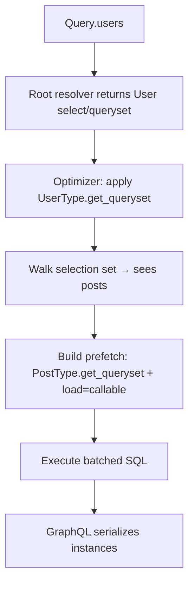

# strawberry-orm

[](https://github.com/strawberry-graphql/strawberry-orm/actions/workflows/tests.yml)
[](https://codecov.io/gh/strawberry-graphql/strawberry-orm)

Backend-agnostic schema generation for [Strawberry GraphQL](https://strawberry.rocks/) on top of Django ORM, SQLAlchemy, and Tortoise ORM.

> **Warning** — `strawberry-orm` is still in **alpha**. Expect breaking changes and incomplete APIs while the package stabilizes.

## Contents

**New to strawberry-orm:** [Installation](#installation) → [Quick Start](#quick-start) → [Backends](#backends) → [Scoping, resolution, and the optimizer](#scoping-resolution-and-the-optimizer)

**Going to production:** [Security](#security) → [Scoping, resolution, and the optimizer](#scoping-resolution-and-the-optimizer) → [Production baseline](#production-baseline)

**Feature reference:** [Guide](#guide) — types, querying, mutations, relay, async

### Part 1 — Get started

- [Installation](#installation)
- [Quick Start](#quick-start)
- [Backends](#backends)

### Part 2 — Scoping and the optimizer

- [Scoping, resolution, and the optimizer](#scoping-resolution-and-the-optimizer)

### Part 3 — Security

- [Security](#security)

### Part 4 — Guide

- [Defining Types](#defining-types)
- [Filters and Ordering](#filters-and-ordering)
- [Custom Filters and Ordering](#custom-filters-and-ordering)
- [Grouping and Aggregation](#grouping-and-aggregation)
- [Mutations](#mutations)
- [Relay Integration](#relay-integration)
- [Async Usage](#async-usage)

### Reference

- [Public Exports](#public-exports)
- [Appendix: Full example](#appendix-full-example)

## Installation

```bash
uv add "strawberry-orm[sqlalchemy]"   # or [django] or [tortoise]
```

Or with pip:

```bash
pip install "strawberry-orm[sqlalchemy]"
```

Requires Python `>=3.12` and `strawberry-graphql>=0.311.0`.

## Quick Start

Minimal blog API: users with published posts only. Assumes SQLAlchemy models `User` and `Post` where `Post.is_published` is a boolean. See [Backends](#backends) to wire session context.

```python
import strawberry
from strawberry_orm import StrawberryORM, auto

orm = StrawberryORM.for_sqlalchemy(
    dialect="postgresql",
    session_getter=lambda info: info.context["session"],
)

@orm.type(Post)
class PostType:
    id: auto
    title: auto

    @classmethod
    def get_queryset(cls, qs, info):
        return qs.filter(is_published=True)  # hide drafts everywhere Post loads

@orm.type(User)
class UserType:
    id: auto
    name: auto
    posts: list[PostType]

@strawberry.type
class Query:
    users: list[UserType] = orm.field()

schema = orm.schema(query=Query)

QUERY = "{ users { name posts { title } } }"
# result = schema.execute_sync(QUERY, context_value={"session": session})
# → drafts excluded; only published post titles under each user
```

**Next:** [Scoping, resolution, and the optimizer](#scoping-resolution-and-the-optimizer) explains why drafts are hidden and what you must configure yourself.

**Production:** [Security](#security)

**Full tour:** [Guide](#guide) · [Appendix: Full example](#appendix-full-example)

---

## Backends

Session and context requirements differ by backend. Tortoise users should also read [Async Usage](#async-usage).

| Backend | Constructor | Notes |
| --- | --- | --- |
| Django | `StrawberryORM.for_django(...)` | Uses Django querysets directly. |
| SQLAlchemy | `StrawberryORM.for_sqlalchemy(dialect="...", session_getter=...)` | Requires a `Session` or `AsyncSession` at resolve time. |
| Tortoise | `StrawberryORM.for_tortoise(...)` | Async ORM; use async Strawberry execution. |

- **Django** — sync and async schema execution both work. Custom async resolvers that touch the ORM directly still need `sync_to_async(...)`.
- **SQLAlchemy** — the session is resolved from `session_getter`, `info.context["session"]`, `info.context.session`, or `info.context.get_session()`. Both sync and async sessions are supported.
- **Tortoise** — async-first. Use `await` in resolvers and mutations.

<details>
<summary>Backend options reference</summary>

Shared options:

| Option | Default | Meaning |
| --- | --- | --- |
| `default_query_limit` | `None` | Default limit for auto-generated list queries. |
| `exclude_sensitive_fields` | `True` | Excludes sensitive-looking fields from generated input/filter/order types. |
| `warn_sensitive` | `True` | Warns when sensitive-looking fields are exposed on output types. |
| `warn_missing_queryset` | `True` | Warns when an `@orm.type` class has no `get_queryset` classmethod. |
| `lazy_resolution` | `"warn"` | `"off"`, `"warn"`, or `"error"` when a GraphQL relation field has no explicit resolver. Use `orm.schema()` for eager loading. |
| `enable_optimizer` | `True` | When using `orm.schema()`, mount the query optimizer extension automatically. |
| `max_filter_depth` | `10` | Caps recursive filter nesting. |
| `max_filter_branches` | `50` | Caps `all` / `any` / `oneOf` branch count. |
| `max_in_list_size` | `500` | Caps `inList` / `notInList` size. |
| `enable_regex_filters` | `False` | Enables `regex` and `iRegex` string lookups. |

Django-only:

| Option | Default | Meaning |
| --- | --- | --- |
| `django_async_safe` | `True` | Offloads sync ORM resolvers with `sync_to_async(thread_sensitive=True)` under async GraphQL. |

SQLAlchemy-only:

| Option | Default | Meaning |
| --- | --- | --- |
| `dialect` | `"postgresql"` | SQLAlchemy dialect. |
| `session_getter` | `None` | Callable returning the session for the current request. |
| `filter_overrides` | `{}` | Maps Python types to custom lookup input types. |

</details>

---

## Scoping, resolution, and the optimizer

Resolution paths drive scoping and N+1 behavior. The [Quick Start](#quick-start) example shows the minimal schema; this chapter explains what happens when it runs.

### Three layers

| Layer | Role |
| --- | --- |
| GraphQL schema | Strawberry types, field resolvers, selection set |
| Optimizer (`orm.schema()`) | Executes query objects, prefetches relations, applies `get_queryset` and field hints |
| ORM backend | Django queryset, SQLAlchemy select, Tortoise QuerySet |

### Resolution flow

For `{ users { name posts { title } } }`:

1. `Query.users` returns a User queryset/select; **`UserType.get_queryset`** may filter it (including joins on related tables — that only affects which users match).
2. The optimizer walks the selection set, sees `posts` under `users`.
3. For prefetch criteria it calls **`PostType.get_queryset`** (and any `load=callable` on `UserType.posts`) — a separate scoping step for Post rows, not a re-run of `UserType.get_queryset`.
4. One batched query loads users and scoped posts.
5. GraphQL reads `user.posts` from prefetched data — no second scoping pass on SQLAlchemy/Django for plain annotation relations.



### `get_queryset` — one model, one type

`define get_queryset` on the `@orm.type` class for the model being loaded. A query with nested fields runs **one hook per model loaded** — not one hook for the whole path:

| Query path | When loading root rows | When loading nested relation |
| --- | --- | --- |
| `posts { … }` | `PostType.get_queryset` | — |
| `users { posts { … } }` | `UserType.get_queryset` | `PostType.get_queryset` on `posts` |
| `posts { author { … } }` | `PostType.get_queryset` | `UserType.get_queryset` on `author` |

The important rule: **`UserType.get_queryset` on the root does not scope Post rows** when `posts` is in the selection — that requires `PostType.get_queryset` (or `UserType.posts` with `load=callable`). Both hooks run, but each only filters its own model's query.

#### Parent scoping does not flow to children

In GraphQL, `users { posts { … } }` looks like one tree — but ORM loading is **per model**, in separate steps. `UserType.get_queryset` runs when **User rows** are fetched for the root field; `PostType.get_queryset` runs when **Post rows** are fetched for the nested `posts` field. Scoping on the parent type does not substitute for scoping on the child type — **even if the parent's `get_queryset` joins or filters on related tables.**

**What parent `get_queryset` can do:** restrict which **parent** rows are returned, including via nested criteria:

```python
@classmethod
def get_queryset(cls, qs, info):
    # ✓ valid — return only users who have at least one published post
    return qs.filter(posts__is_published=True).distinct()
```

For `{ users { name } }` (no `posts` in the selection), this correctly hides users with no published work. The filter runs on the **User query** — it does not configure how Post rows load later.

**What it cannot do:** scope the nested `posts` field when clients request child data. The join above checks *existence* of a matching post; it does not limit which posts appear under each user when the relation is loaded:

```python
@orm.type(User)
class UserType:
    id: auto
    name: auto
    posts: list[PostType]

    @classmethod
    def get_queryset(cls, qs, info):
        return qs.filter(posts__is_published=True).distinct()

@orm.type(Post)
class PostType:
    id: auto
    title: auto
    # no get_queryset
```

**Database:**

| User | Post | is_published | author |
| --- | --- | --- | --- |
| Alice | "Hello world" | true | Alice |
| Alice | "Secret draft" | false | Alice |
| Bob | "Bob's only post" | false | Bob |

**Query:** `{ users { name posts { title } } }`

| Step | Hook | Effect |
| --- | --- | --- |
| Load users | `UserType.get_queryset` | Alice included (has a published post); Bob excluded |
| Load posts | `PostType.get_queryset` | *not defined* — all of Alice's posts load |

```json
{
  "users": [
    {
      "name": "Alice",
      "posts": [
        { "title": "Hello world" },
        { "title": "Secret draft" }
      ]
    }
  ]
}
```

Alice passed the parent filter because she *has* a published post, but the draft still appears — the nested load never ran `UserType.get_queryset` again and never applied a publish filter to Post rows.

**Rule of thumb:**

| Goal | Where to scope |
| --- | --- |
| Hide users with no published posts | `UserType.get_queryset` with a join/exists on `posts` |
| Hide draft posts under each user | `PostType.get_queryset` (or `UserType.posts` with `load=callable`) |
| Both | **both** — parent join for user list, child scope for post rows |

**Example — active users, unscoped posts (no nested join):**

```python
@orm.type(User)
class UserType:
    id: auto
    name: auto
    posts: list[PostType]

    @classmethod
    def get_queryset(cls, qs, info):
        return qs.filter(is_active=True)  # scope User rows only

@orm.type(Post)
class PostType:
    id: auto
    title: auto
    # no get_queryset — Post rows are unscoped
```

Same leak: Bob (inactive) is excluded, but Alice's draft still appears under `posts` because **`UserType.get_queryset` only filters the users table**, not the posts loaded via the relation.

**Fix — scope Post rows wherever they load:**

```python
@orm.type(Post)
class PostType:
    id: auto
    title: auto

    @classmethod
    def get_queryset(cls, qs, info):
        return qs.filter(is_published=True)  # scope Post rows everywhere they load
```

Now `{ users { posts { title } } }` and `{ posts { title } }` both hide drafts. The same rule applies for multi-tenant IDs, soft deletes, or auth: **scope every model type clients can reach**, not just the root — and don't assume a parent join replaces child scoping.

> `UserType.posts` with `load=callable` adds extra criteria on that **relation edge** only — it still composes on top of `PostType.get_queryset`, and does not replace it. See [Tracing scoping hooks](#tracing-scoping-hooks).

### Resolver kinds

| Kind | Example | Scoping |
| --- | --- | --- |
| Root list | `users: list[UserType] = orm.field()` | Optimizer + `UserType.get_queryset` |
| Root custom queryset | `@orm.field def active_users(): return select(User).where(...)` | Optimizer + `UserType.get_queryset` on root; nested fields use child types' hooks — see [Root custom queryset](#root-custom-queryset) |
| Annotation relation | `posts: list[PostType]` | Related type's `get_queryset`; optimizer prefetch |
| Field `load=callable` | `orm.field(load=lambda qs: …)` | Composes **after** related type's `get_queryset` |
| `@orm.field` override | `def author(self): return self.author` | Resolver as written; scoping via prefetch only |
| `@strawberry.field` override | fully custom | You own scoping and auth |
| Root returns instances | `return session.scalars(select(User)).all()` | Optimizer skipped; nested relations may be unscoped |

### Scoping hooks run at prefetch time

`get_queryset` and `load=callable` run **before SQL executes**, during optimizer prefetch setup. They compose in order: **type-level first, then field-level**.

| Mechanism | Purpose | Composes with `get_queryset` |
| --- | --- | --- |
| `get_queryset` on related type | Default row scope for that model | — (base layer) |
| `load=callable` on parent field | Extra scope for this relation edge | Yes, second |
| `load=["rel"]` list | Extra eager-load paths only | No filtering |

**When scoping does not run:** `strawberry.Schema(query=Query)` without `orm.schema()` on SQLAlchemy/Django skips prefetch scoping hooks. Custom root resolvers that return materialized instances skip the optimizer entirely.

**Tortoise note:** annotation-only list relations also apply `_apply_nested_queryset` at resolve time when prefetch did not run. The **`get_queryset` then `load=callable`** order is the same inside that helper.

### Tracing scoping hooks

Add `print(..., flush=True)` to see hook order. The repo tests this by patching `print` — see `tests/backends/*/test_query_scoping_hook_order.py`.

```python
@classmethod
def get_queryset(cls, qs, info):
    print("SCOPE:PostType.get_queryset", flush=True)
    return qs.filter(is_published=True)

posts: list[PostType] = orm.field(
    load=lambda qs: (
        print("SCOPE:UserType.posts.load", flush=True) or qs.filter(title != "GraphQL Guide")
    )
)
```

For `{ users { name posts { title } } }`, stdout is always:

```
SCOPE:PostType.get_queryset
SCOPE:UserType.posts.load
```

With plain `posts: list[PostType]` (no `load=`), only the first line appears. Neither hook runs again when GraphQL reads each `user.posts`.

### Root custom queryset

A **root** `Query` field (e.g. `active_users`) is not a nested relation — it returns User rows directly. With `orm.schema()`, returning an unexecuted select/queryset still triggers the optimizer: `UserType.get_queryset` composes on your filter, and nested fields like `posts` get `PostType.get_queryset` during prefetch.

```python
@strawberry.type
class Query:
    @orm.field
    def active_users(self, info) -> list[UserType]:
        return select(User).where(User.is_active.is_(True))  # ✓ query object

    # users: list[UserType] = orm.field()  # alternative: get_default_queryset + UserType.get_queryset
```

Return a query object, not `session.scalars(...).all()`. Prefer `UserType.get_queryset` when the same scope applies everywhere User loads; use a custom root resolver for entry-point-specific criteria. See [List Fields](#list-fields) for a comparison table.

### `orm.schema()`

Build schemas with `orm.schema()` — the query optimizer is **enabled by default**. It executes backend query objects, eager-loads relations from the selection set, applies field hints, and honors `get_queryset`. On SQLAlchemy and Django, nested scoping depends on this — not optional for correct row access.

```python
schema = orm.schema(query=Query, mutation=Mutation)

schema = orm.schema(query=Query, extensions=[MyCustomExtension()])

# Opt out per schema or globally:
schema = orm.schema(query=Query, optimizer=False)
orm = StrawberryORM.for_sqlalchemy(enable_optimizer=False, ...)
```

#### Field hints

Inside `@orm.type(...)`, `orm.field(...)` attaches optimizer metadata:

```python
@orm.type(Post)
class PostType:
    id: auto
    title: auto
    tags: list[TagType] = orm.field(load=["author"])
    body: auto = orm.field(only=["id", "title", "body"])

@orm.type(User)
class UserType:
    posts: list[PostType] = orm.field(load=lambda qs: qs.filter(is_published=True))
```

| Argument | Meaning |
| --- | --- |
| `load=[...]` | Extra eager-load paths (no filtering). |
| `load=callable` | Extra scope on this relation edge; composes after `get_queryset`. |
| `only=[...]` | Restrict loaded columns. |
| `compute={...}` | Computed-column hints for the optimizer store. |
| `disable_optimization=True` | Skip optimization for that field. |
| `description="..."` | Forward a field description to Strawberry. |

#### Tangible example: root queryset vs `load=`

Clients often use a **custom root resolver** that already returns a filtered queryset. That scopes **User** rows for that field only. Nested `posts` still load in a **separate optimizer step** — there is no resolver on `UserType.posts` that returns `Post.objects…`, so you cannot “fix drafts” by returning a queryset higher in the tree.

**Schema (Django):**

```python
from typing import Annotated

import strawberry

from strawberry_orm import StrawberryORM
from strawberry_orm.types import auto

orm = StrawberryORM.for_django()

from myapp.models import Post, User  # Django models


@orm.type(Post)
class PostType:
    id: auto
    title: auto
    is_published: auto


@orm.type(User)
class UserType:
    id: auto
    name: auto
    # No custom resolver — optimizer prefetches posts when the query asks for them.
    posts: list[PostType] = orm.field(
        load=lambda qs: qs.filter(is_published=True)  # scope this edge only
    )


@strawberry.type
class Query:
    @orm.field
    def active_users(self, info) -> list[UserType]:
        # ✓ Scopes which *users* are returned from this field
        return User.objects.filter(is_active=True)
```

**What goes wrong without `load=` (or `PostType.get_queryset`):**

```graphql
query {
  activeUsers {
    name
    posts {
      title
      isPublished
    }
  }
}
```

| Row | User | Post title | is_published |
| --- | --- | --- | --- |
| 1 | Alice (active) | Hello world | true |
| 2 | Alice (active) | Secret draft | false |
| 3 | Bob (inactive) | — | — |

`active_users` excludes Bob, but Alice’s draft still appears under `posts` — the root queryset never filtered **Post** rows.

**What each mechanism does here:**

| Mechanism | Runs when | Effect in this example |
| --- | --- | --- |
| `active_users` returns `User.objects.filter(is_active=True)` | Root field resolve | Hides inactive users |
| Optimizer walks `posts { title isPublished }` | Before SQL on users | Adds `prefetch_related` for `posts` |
| `load=lambda qs: qs.filter(is_published=True)` on `UserType.posts` | Building that prefetch | Drops draft posts under each user |
| `PostType.get_queryset` (alternative) | Same prefetch step | Same publish filter for **all** Post loads |

You do **not** need `load=["posts"]` when the client already selects `posts { … }` — the optimizer follows the selection set (including `... on SomeType` inline fragments and named fragment spreads). Use `load=[...]` when you want extra joins beyond what the query selected, or `load=callable` / `get_queryset` when nested rows must be filtered.

**Union inline fragments** — common in production APIs:

```graphql
query {
  activeUsers {
    posts {
      ... on PostType {
        title
        isPublished
      }
    }
  }
}
```

With `orm.schema()`, the optimizer walks fields inside each inline branch so `posts` and nested relations are still prefetched (no `AttributeError` on fragment nodes).

Field permissions via `make_field(permission_classes=[...])` — see [Defining Types](#defining-types).

> If nested rows are unscoped, verify `orm.schema()`, query objects at the root, and `get_queryset` on every exposed type. See [Security](#security).

---

## Security

`strawberry-orm` has safety-focused defaults, but schema design determines what clients can read and write.

### What the library does by default

- `orm.input()`, `orm.filter()`, and `orm.order()` exclude sensitive-looking fields (`password_hash`, `api_key`, `role`, `is_admin`, etc.)
- String regex filters are disabled by default
- Filter depth, branch count, and `inList` size are capped
- `orm.ref()` provides explicit `unlink` and `delete` operations — both opt-in via `unlink=True` and `delete=True`
- When you use `orm.schema()` (optimizer enabled by default), nested relation loads honor each type's `get_queryset` — but **only for types where you define it** (the ORM warns at type registration when `get_queryset` is missing)

### Your responsibility

| Concern | Library | You |
| --- | --- | --- |
| Authentication | — | middleware, `info.context`, permission classes |
| Row access | `get_queryset` per exposed type | define on **every** model type clients can reach — [parent scoping does not flow to children](#parent-scoping-does-not-flow-to-children) |
| Column exposure | — | `exclude=[...]` on `@orm.type`, or `make_field(permission_classes=…)` |
| Query size | — | `default_query_limit` |
| Mutations | — | auth in resolvers; `authorize` callback on `apply_ref_list` |
| Custom resolvers | — | same as hand-written DB access — you own scoping |

### Common mistakes

Each item links to the scoping chapter for mechanics. Expand for full examples.

- **Parent `get_queryset` does not scope nested `posts`** — including joins like `posts__is_published=True` on User. → [Parent scoping does not flow to children](#parent-scoping-does-not-flow-to-children)
- **Custom `@strawberry.field` on relations** — e.g. `return self.posts.all()` skips `PostType.get_queryset`. → [Resolver kinds](#resolver-kinds)
- **`strawberry.Schema` instead of `orm.schema()`** — nested scoping hooks skipped on SQLAlchemy/Django. → [`orm.schema()`](#ormschema)
- **Root resolver returns materialized instances** — optimizer cannot prefetch or scope nested relations. → [Root custom queryset](#root-custom-queryset)
- **`get_queryset` ignores `info.context`** — hardcoded tenant/user filters leak cross-request. → [`get_queryset`](#get_queryset--one-model-one-type)
- **`@orm.type` exposes sensitive columns via `auto`** — output types do not auto-hide secrets. → [Defining Types](#defining-types)

<details>
<summary>Full mistake examples</summary>

#### `UserType.get_queryset` does not filter `users { posts }`

```python
@classmethod
def get_queryset(cls, qs, info):
    return qs.filter(posts__is_published=True).distinct()
    # ✓ { users { name } }  ✗ drafts still under { users { posts { title } } }
```

#### Custom `@strawberry.field` resolvers bypass auto scoping

```python
@strawberry.field
def posts(self) -> list[PostType]:
    return self.posts.all()  # PostType.get_queryset never applied
```

#### `strawberry.Schema(...)` instead of `orm.schema(...)`

```python
schema = strawberry.Schema(query=Query)  # ✗ drafts visible via lazy loads
```

#### Root resolver returns materialized instances

```python
return session.scalars(select(User)).all()  # ✗
return orm.get_default_queryset(User)      # ✓
```

#### `get_queryset` ignores `info.context`

```python
return qs.filter(tenant_id=info.context["tenant_id"])  # ✓ not hardcoded
```

#### `@orm.type` exposes sensitive columns via `auto`

```python
@orm.type(User, exclude=["password_hash", "api_key"])
class UserType:
    id: auto
    name: auto
```

</details>

### Production baseline

```python
orm = StrawberryORM.for_sqlalchemy(
    dialect="postgresql",
    session_getter=lambda info: info.context["session"],
    default_query_limit=100,
    max_filter_depth=8,
    max_filter_branches=25,
    max_in_list_size=200,
)

schema = orm.schema(query=Query)  # optimizer on by default
```

---

## Guide

Feature documentation below assumes [Scoping, resolution, and the optimizer](#scoping-resolution-and-the-optimizer). Each section covers one capability — types, querying, writes, relay, async.

---

## Defining Types

Relation fields load the **related** model; scoping is per type — see [Scoping, resolution, and the optimizer](#scoping-resolution-and-the-optimizer).

### `@orm.type(Model)`

```python
from strawberry_orm import auto

@orm.type(User)
class UserType:
    id: auto
    name: auto
    email: auto
```

`auto` is an alias for `strawberry.auto`. The backend inspects the model and resolves the Python type for each field.

Keyword arguments: `include`, `exclude`, `name`, `filters`, `order`.

```python
@orm.type(User, exclude=["password_hash", "api_key"], name="PublicUser")
class PublicUserType:
    id: auto
    name: auto
    email: auto
```

### Relations

Reference other generated types directly. The backend auto-generates resolvers for relationship fields:

```python
@orm.type(Post)
class PostType:
    id: auto
    title: auto
    tags: list[TagType]
```

If the nested type carries `filters` and/or `order`, list relations expose those arguments automatically.

### `@orm.field` Decorator

Overrides auto-generated resolvers — see the [resolver kinds](#resolver-kinds) table. Use `@orm.field` (bare, without parentheses) as a decorator on resolver methods. It works for related models, computed fields, and querysets:

```python
@orm.type(Post)
class PostType:
    id: auto
    title: auto

    # Forward FK — resolves a single related model
    @orm.field
    def author(self) -> UserType:
        return self.author

    # Computed scalar
    @orm.field
    def title_upper(self) -> str:
        return self.title.upper()
```

When the return type is a `list[T]` where `T` has filters/ordering, **`@orm.field()`** (with parentheses) auto-adds `filter` and `order` arguments — just like the assignment form. Bare `@orm.field` without parentheses does not.

`@orm.field()` with parentheses also accepts keyword arguments (`filters`, `order`, `load`, `only`, etc.).

### List Fields

`orm.field()` builds a list resolver from the model attached to the return type:

```python
@strawberry.type
class Query:
    users: list[UserType] = orm.field()
```

For a root field with custom criteria, return an unexecuted select/queryset from `@orm.field` — still optimized by `orm.schema()`. See [Root custom queryset](#root-custom-queryset).

Define row scope on the type with `get_queryset` — see [`get_queryset`](#get_queryset--one-model-one-type) and the [Quick Start](#quick-start).

### Custom Fields

Mix generated fields with custom resolvers. Use `@orm.field` for resolvers that return ORM data, or `@strawberry.field` for purely computed values:

```python
@orm.type(User)
class UserType:
    id: auto
    name: auto
    email: auto = make_field(permission_classes=[IsAuthenticated])  # from strawberry_orm

    @orm.field
    def display_name(self) -> str:
        return f"{self.name} <{self.email}>"
```

### `orm.input(Model)` and `orm.partial(Model)`

Generate input types from model metadata:

```python
CreateUserInput = orm.input(User, include=["name", "email"])
UpdateUserInput = orm.partial(User, include=["name", "email"])
```

`input()` and `partial()` share the same signature: `include`, `exclude`, `exclude_pk` (default `True`), `name`. Fields are optional (defaulting to `strawberry.UNSET`), skip relations, exclude primary keys by default, and exclude sensitive-looking fields unless explicitly included.

---

## Filters and Ordering

Filters narrow rows **within** a type's queryset; they do not replace `get_queryset` — see [Security](#security) and [Scoping, resolution, and the optimizer](#scoping-resolution-and-the-optimizer).

### Filters

Generate a filter input and attach it to a type:

```python
UserFilter = orm.filter(User)

@orm.type(User, filters=UserFilter)
class UserType:
    id: auto
    name: auto
    email: auto
```

List fields returning `UserType` then accept a `filter` argument:

```graphql
{
  users(filter: { field: { name: { exact: "Alice" } } }) {
    id
    name
  }
}
```

#### Filter Shape

Filters are recursive `@oneOf` trees supporting `field`, `all`, `any`, `not`, and `oneOf`:

```graphql
# OR
{ users(filter: { any: [
    { field: { name: { exact: "Alice" } } }
    { field: { name: { exact: "Bob" } } }
] }) { name } }

# AND
{ posts(filter: { all: [
    { object: { author: { field: { id: { exact: 1 } } } } }
    { field: { isPublished: { exact: true } } }
] }) { title } }

# NOT
{ users(filter: {
    not: { field: { email: { contains: "example.com" } } }
}) { name } }
```

<details>
<summary>Built-in lookup types</summary>

`StringLookup`, `BooleanLookup`, `IDLookup`, `IntComparisonLookup`, `FloatComparisonLookup`, `DateComparisonLookup`, `TimeComparisonLookup`, `DateTimeComparisonLookup`

Typical string lookups: `exact`, `neq`, `contains`, `iContains`, `startsWith`, `iStartsWith`, `endsWith`, `iEndsWith`, `inList`, `notInList`, `isNull`.

Regex lookups (`regex`, `iRegex`) are disabled by default. Enable with `enable_regex_filters=True`.

</details>

#### Object Traversal

When filters are registered for related models, the generated filter gains an `object` key for filtering by conditions on related objects:

```python
UserFilter = orm.filter(User)
PostFilter = orm.filter(Post)   # Post has an "author" relation to User
```

```graphql
{
  posts(filter: {
    object: { author: { field: { name: { exact: "Alice" } } } }
  }) { title }
}
```

Object traversal composes with boolean operators and supports multi-level nesting when intermediate models also have registered filters:

```graphql
# Comments on posts written by Alice
{
  comments(filter: {
    object: { post: {
      object: { author: { field: { name: { exact: "Alice" } } } }
    } }
  }) { body }
}
```

The `object` type is `@oneOf`. Relations only appear in `object` if their target model already has a registered filter at the time `orm.filter()` is called -- register leaf models first.

#### Filter Projection

Pass `project={...}` to control which relations appear in `object` and how deep traversal can go:

```python
UserFilter    = orm.filter(User)
TagFilter     = orm.filter(Tag)
CommentFilter = orm.filter(Comment)

PostFilter = orm.filter(Post, project={"author": {}})  # only author, not tags/comments
```

Sub-project dicts control nested traversal. `{}` means "include as a leaf" (no further object traversal). A non-empty dict lists reachable relations:

```python
CommentFilter = orm.filter(Comment, project={
    "post": {"author": {}},   # Comment -> post -> author (but not post -> tags)
})
```

| `project` value | Behavior |
| --- | --- |
| `None` (default) | Auto-include all relations with registered filters |
| `{}` | No `object` type (scalar lookups only) |
| `{"rel": {}}` | Include `rel` as a leaf |
| `{"rel": {"nested": {}}}` | Include `rel`, allow traversal to `nested` from it |

Projected filters are cached internally and do not overwrite the global filter registry.

### Ordering

```python
UserOrder = orm.order(User)
```

Each order entry is a `@oneOf` input with a `field` key (for scalar columns) or an `object` key (for related models). Position in the list determines tie-break priority:

```graphql
{
  users(order: [{ field: { name: ASC } }, { field: { email: DESC } }]) {
    name
    email
  }
}
```

Supported values: `ASC`, `ASC_NULLS_FIRST`, `ASC_NULLS_LAST`, `DESC`, `DESC_NULLS_FIRST`, `DESC_NULLS_LAST`.

#### Order by Related Object

When order types are registered for related models, the generated order gains an `object` key that lets you sort by fields on related objects — mirroring the [filter object traversal](#object-traversal) structure:

```graphql
{
  posts(order: [
    { object: { author: { field: { name: ASC } } } }
    { field: { title: DESC } }
  ]) {
    title
  }
}
```

Registration order matters: define related orders *before* the parent (e.g. `orm.order(User)` before `orm.order(Post)`).

---

## Custom Filters and Ordering

`orm.filter()` and `orm.order()` auto-generate types from model introspection. When you need filter logic that goes beyond column lookups — full-text search across multiple fields, subquery-based conditions, or ordering by computed values — use `orm.filter_type()` and `orm.order_type()` with the `@filter_field` and `@order_field` decorators.

### Custom Filter Types

`orm.filter_type(Model)` is a class decorator. Annotate fields with `auto` for standard lookups (identical to what `orm.filter()` generates). Add methods decorated with `@filter_field` for custom logic:

```python
from strawberry_orm import StrawberryORM, filter_field, auto

orm = StrawberryORM.for_sqlalchemy(dialect="postgresql", session_getter=...)

@orm.filter_type(User)
class UserFilter:
    name: auto          # standard StringLookup
    email: auto         # standard StringLookup

    @filter_field
    def search(self, value: str, query):
        """Full-text search across name and email."""
        from sqlalchemy import or_
        return query.where(
            or_(User.name.ilike(f"%{value}%"), User.email.ilike(f"%{value}%"))
        )

    @filter_field
    def has_posts(self, value: bool, query):
        """Filter users who have (or lack) any posts."""
        from sqlalchemy import func, select
        subq = (
            select(func.count(Post.id))
            .where(Post.author_id == User.id)
            .correlate(User)
            .scalar_subquery()
        )
        if value:
            return query.where(subq > 0)
        return query.where(subq == 0)
```

Each `@filter_field` method must:

- Have a `value` parameter with a **type annotation** — this becomes the GraphQL input type for the field.
- Have a `query` parameter — receives the backend's native query object (Django `QuerySet`, SQLAlchemy `Select`, or Tortoise `QuerySet`).
- Return the modified query.
- Optionally accept an `info` parameter to receive the Strawberry `Info` context.

The generated GraphQL input places custom fields as top-level keys alongside `field`, `object`, `all`, `any`, `not`, and `oneOf`:

```graphql
input UserFilter @oneOf {
  field: UserField           # auto-generated scalar lookups
  object: UserFilterObject   # auto-generated relation lookups (if any)
  search: String             # custom
  hasPosts: Boolean          # custom
  all: [UserFilter!]
  any: [UserFilter!]
  not: UserFilter
  oneOf: [UserFilter!]
}
```

Since filters are `@oneOf`, combine custom filters with standard lookups using `all` or `any`:

```graphql
{
  users(filter: { all: [
    { search: "john" },
    { field: { email: { contains: "example.com" } } }
  ] }) {
    name
    email
  }
}
```

### Custom Order Types

`orm.order_type(Model)` works the same way. `auto` fields get the standard `Ordering` enum. Methods decorated with `@order_field` receive a `value` of type `Ordering` (ASC, DESC, etc.) and return the modified query:

```python
from strawberry_orm import order_field
from strawberry_orm.types import Ordering

@orm.order_type(User)
class UserOrder:
    name: auto          # standard Ordering (ASC/DESC/...)

    @order_field
    def post_count(self, value: Ordering, query):
        """Order users by how many posts they have."""
        from sqlalchemy import func
        query = query.outerjoin(Post, Post.author_id == User.id).group_by(User.id)
        col = func.count(Post.id)
        if "DESC" in value.value:
            return query.order_by(col.desc())
        return query.order_by(col.asc())
```

The generated GraphQL input:

```graphql
input UserOrder @oneOf {
  field: UserOrderField      # auto-generated
  object: UserOrderObject    # auto-generated (if relations exist)
  postCount: Ordering        # custom
}
```

Custom and standard orders compose naturally in the order list:

```graphql
{
  users(order: [
    { postCount: DESC },
    { field: { name: ASC } }
  ]) {
    name
  }
}
```

### Using Custom Types

Custom filter and order types are used exactly like auto-generated ones:

```python
@orm.type(User, filters=UserFilter, order=UserOrder)
class UserType:
    id: auto
    name: auto
    email: auto

@strawberry.type
class Query:
    @orm.field
    def users(self) -> list[UserType]:
        return orm.get_default_queryset(User)
```

They also work with Relay connections and `orm.connection()`.

### Backend-Specific Examples

The query manipulation inside `@filter_field` and `@order_field` methods is backend-specific since it operates on native query objects. Here are equivalent examples for each backend:

<details>
<summary>Django</summary>

```python
from django.db.models import Q, Count, F

@orm.filter_type(User)
class UserFilter:
    name: auto

    @filter_field
    def search(self, value: str, query):
        return query.filter(Q(name__icontains=value) | Q(email__icontains=value))

@orm.order_type(User)
class UserOrder:
    name: auto

    @order_field
    def post_count(self, value: Ordering, query):
        query = query.annotate(_post_count=Count("posts"))
        dir_value = value.value
        if dir_value.startswith("DESC"):
            return query.order_by(F("_post_count").desc())
        return query.order_by(F("_post_count").asc())
```

</details>

<details>
<summary>Tortoise</summary>

```python
from tortoise.queryset import Q
from tortoise.functions import Count

@orm.filter_type(User)
class UserFilter:
    name: auto

    @filter_field
    def search(self, value: str, query):
        return query.filter(Q(name__icontains=value) | Q(email__icontains=value))

@orm.order_type(User)
class UserOrder:
    name: auto

    @order_field
    def post_count(self, value: Ordering, query):
        query = query.annotate(_post_count=Count("posts"))
        if value.value.startswith("DESC"):
            return query.order_by("-_post_count")
        return query.order_by("_post_count")
```

</details>

### Custom Group-By Types

`orm.group_type(Model)` works like `orm.filter_type()` and `orm.order_type()`. `auto` fields get the standard group-by type (`Boolean` or `DateGroupByOption`). Methods decorated with `@group_field` add custom grouping logic:

```python
from strawberry_orm import group_field

@orm.group_type(Order)
class OrderGroupBy:
    status: auto         # standard Boolean group-by
    created_at: auto     # DateGroupByOption with interval

    @group_field
    def by_customer_tier(self, value: bool, query):
        """Group by a computed customer tier."""
        from sqlalchemy import case
        return case(
            (Order.amount >= 100, "premium"),
            else_="standard",
        ).label("customer_tier")
```

### Combining with `orm.filter()` / `orm.order()`

`orm.filter()`, `orm.order()`, and `orm.group()` remain available for fully auto-generated types. Use `orm.filter_type()`, `orm.order_type()`, and `orm.group_type()` only when you need custom logic. The types produced by both APIs are interchangeable in all contexts — `orm.type(Model, filters=..., order=..., group=...)`, `orm.field(filters=..., order=...)`, and `orm.connection()`.

---

## Grouping and Aggregation

Group-by and aggregation are available on Relay connection fields. Register a group-by type for a model and pass it to `orm.type()`:

```python
from strawberry import relay
from strawberry_orm import StrawberryORM, auto
from strawberry_orm.relay import ORMListConnection

orm = StrawberryORM.for_sqlalchemy(dialect="postgresql", session_getter=...)

OrderFilter  = orm.filter(Order)
OrderOrder   = orm.order(Order)
OrderGroupBy = orm.group(Order)

@orm.type(Order, filters=OrderFilter, order=OrderOrder, group=OrderGroupBy)
class OrderNode(relay.Node):
    id: relay.NodeID[int]
    status: auto
    amount: auto
    quantity: auto
    created_at: auto

@strawberry.type
class Query:
    orders: ORMListConnection[OrderNode] = orm.connection()

schema = orm.schema(query=Query)
```

When `group` is set, the generated connection type automatically includes `aggregates`, `groups`, and an extended `pageInfo` with aggregate data.

### Querying Aggregates

```graphql
{
  orders(first: 100) {
    pageInfo {
      hasNextPage
      aggregates {
        count
        sum { amount }
        avg { amount }
      }
    }
    edges {
      node { status amount }
    }
  }
}
```

Aggregates are computed over the full filtered result set (before pagination). Page-level aggregates in `pageInfo` cover only the current page.

Auto-generated aggregate types include `count`, `sum`, `avg`, `min`, and `max` — scoped to the numeric and comparable fields on the model.

### Querying Groups

```graphql
{
  orders(
    groupBy: [{ field: { status: true } }]
    first: 100
  ) {
    groups {
      key { status }
      aggregates {
        count
        sum { amount }
        avg { amount }
      }
      edgeIndices
      items(first: 5) {
        edges {
          node { status amount quantity }
        }
      }
    }
    edges {
      node { status amount }
    }
  }
}
```

Each group includes:

- `key` — the group-by column values
- `aggregates` — per-group aggregate values (count, sum, avg, min, max)
- `edgeIndices` — indices into the parent connection's `edges` array
- `items` — a nested cursor-paginated connection of items in that group

Date/datetime fields support interval-based grouping:

```graphql
{
  orders(
    groupBy: [{ field: { createdAt: { interval: MONTH } } }]
  ) {
    groups {
      key { createdAt }
      aggregates { count }
    }
  }
}
```

Supported intervals: `DAY`, `WEEK`, `MONTH`, `QUARTER`, `YEAR`.

### Custom Aggregates

Use `@aggregate_field` to define computed aggregate expressions:

```python
from strawberry_orm import aggregate_field

@orm.aggregate_type(Order)
class OrderAggregation:
    amount: auto
    quantity: auto

    @aggregate_field
    def total_revenue(self, columns) -> float:
        from sqlalchemy import func
        return func.sum(columns.amount * columns.quantity)
```

---

## Mutations

Write plain `@strawberry.mutation` resolvers and use `strawberry-orm` for generated input types. Authorization and row-level checks are your responsibility — see [Security](#security).

```python
CreatePostInput = orm.input(Post, include=["title", "body", "author_id"])

@strawberry.type
class Mutation:
    @strawberry.mutation
    def create_post(self, info: strawberry.types.Info, input: CreatePostInput) -> PostType:
        post = Post(title=input.title, body=input.body, author_id=input.author_id)
        ...
        return post
```

### Related List Inputs (`orm.ref`)

`orm.ref(...)` generates a `@oneOf` input for managing related lists:

```python
CreateTagInput = orm.input(Tag, include=["name"])

@strawberry.input
class UpdateTagInput:
    id: strawberry.ID
    name: str | None = strawberry.UNSET

TagRef = orm.ref(Tag, create=CreateTagInput, update=UpdateTagInput, unlink=True, delete=True)
```

Each ref is a `@oneOf` with these keys:

- `update` — link an existing object by ID, or update its fields. Always present (an ID-only input is auto-generated if no custom `update` type is provided).
- `create` — create a new related object (present when `create=` is provided).
- `unlink` — remove the object from the relation without deleting it (present when `unlink=True`).
- `delete` — hard-delete the related row (present when `delete=True`).

All list mutations use **patch semantics**: only the items you mention are affected; existing related objects not listed are left untouched.

Apply ref operations with `orm.apply_ref_list(parent, "relation_name", refs, info)`. An optional `authorize` callback `(action, model, obj_id, info) -> bool` can be provided for per-operation authorization.

```graphql
mutation {
  setPostTags(postId: 1, tags: [
    { update: { id: "2" } }
    { update: { id: "1", name: "python3" } }
    { create: { name: "new-tag" } }
    { unlink: { id: "3" } }
    { delete: { id: "4" } }
  ]) {
    tags { id name }
  }
}
```

> **Note:** Whether the order of items in the list affects the final ordering of the relation is an implementation detail that each backend must maintain.

### Recursive Node Mutations

`orm.mutations.create_node()` and `orm.mutations.update_node()` generate catch-all Relay `Node` mutations with recursive nested inputs:

```python
@orm.type(Post)
class PostNode(relay.Node):
    id: relay.NodeID[int]
    title: auto
    body: auto

@strawberry.type
class Mutation:
    create_node = orm.mutations.create_node()
    update_node = orm.mutations.update_node()
```

```graphql
mutation {
  createNode(input: {
    post: {
      title: "Hello"
      body: "World"
      author: { create: { name: "Alice", email: "alice@example.com" } }
      tags: [{ create: { name: "python" } }]
    }
  }) { __typename }
}
```

List relations are flat arrays of ref operations (same `@oneOf` shape as `orm.ref`). Patch semantics apply — only mentioned items are affected.

Generate only the input types (without the resolver) via `orm.mutations.create_node_input()` and `orm.mutations.update_node_input()`.

<details>
<summary>Mutation projection and policy config</summary>

Pass `project={...}` to restrict recursion depth and configure relation semantics:

```python
project = {
    "post": {
        "author": {
            "_meta": {"onReplace": ["DISCONNECT", "DELETE"]},
        },
        "comments": {
            "author": {"_meta": {"onReplace": ["DISCONNECT", "DELETE"]}},
        },
        "tags": {},
    },
    "comment": {
        "author": {"_meta": {"onReplace": ["DISCONNECT", "DELETE"]}},
    },
}

@strawberry.type
class Mutation:
    create_node = orm.mutations.create_node(project=project)
    update_node = orm.mutations.update_node(project=project)
```

Rules:

- Root keys are model names (`post`, `comment`, ...).
- Nested keys are relation names on that model.
- `_meta` configures behavior for that relation subtree.
- Omitted relations still appear as shallow inputs (one more level, then stop).

`_meta` supports:

- `onReplace` — `"DISCONNECT"` or `"DELETE"`, or an array of both to expose a choice. Controls what happens to the previous object when replacing a singular (FK) relation via `create` or `upsert`. Default: `DISCONNECT`. Only exposed when `create` or `upsert` is enabled.
- `create` — `True` (all scalars) or a list of scalar field names. Enables the nested `create` branch and defines its writable scalars.
- `update` — `True` or a list of scalar field names. Enables the nested `update` branch (always includes required `id`).
- `upsert` — `{"where": ["email"]}` (string or list). Enables nested `upsert` with Prisma-like `{ where, create, update }`. Create/update payload types reuse the `create` / `update` allowlists when those keys are present; otherwise both sides default to all scalars. Never nest field lists under `upsert`.
- `unlink` / `delete` — `True` on list (to-many) relations only.

When none of `create` / `update` / `upsert` / `unlink` / `delete` are present, behavior matches today (singular: create+update; list: create+update+unlink+delete; all scalars). If any of those keys is present, only the listed ops are generated.

Relations always follow the projection tree (not re-listed in `_meta`). Values for `onReplace` can be a single string (fixes behavior, omits the GraphQL field) or an array of strings (exposes a choice to the caller).

Example with per-op fields and upsert:

```python
project = {
    "post": {
        "author": {
            "_meta": {
                "onReplace": ["DISCONNECT", "DELETE"],
                "create": ["email", "name"],
                "update": ["name"],
                "upsert": {"where": ["email"]},
            },
        },
        "tags": {
            "_meta": {
                "upsert": {"where": ["name"]},
                "unlink": True,
            },
        },
    },
}
```

```graphql
author: {
  upsert: {
    where: { email: "ada@example.com" }
    create: { email: "ada@example.com", name: "Ada" }
    update: { name: "Ada Lovelace" }
  }
}
```

</details>

---

## Relay Integration

`strawberry-orm` works with [Strawberry's Relay support](https://strawberry.rocks/docs/guides/relay) for cursor-based pagination and global node identification.

### Relay Node Types

Extend `relay.Node` instead of a plain Strawberry type. Use `relay.NodeID` for the id field:

```python
from strawberry import relay
from strawberry_orm import StrawberryORM, auto

orm = StrawberryORM.for_sqlalchemy(dialect="postgresql", session_getter=...)

UserFilter = orm.filter(User)
UserOrder  = orm.order(User)

@orm.type(User, filters=UserFilter, order=UserOrder)
class UserNode(relay.Node):
    id: relay.NodeID[int]
    name: auto
    email: auto
```

### Connection Fields

Use `orm.connection()` with `ORMListConnection` to create paginated connection fields. Filters and ordering from the node type are automatically wired in:

```python
from collections.abc import Iterable
from strawberry_orm.relay import ORMListConnection

@strawberry.type
class Query:
    @orm.connection(ORMListConnection[UserNode])
    def users_connection(self) -> Iterable[UserNode]:
        return orm.get_default_queryset(User)
```

This gives you:

```graphql
{
  usersConnection(
    filter: { field: { email: { contains: "example.com" } } }
    order: [{ field: { name: DESC } }]
    first: 10
    after: "YXJyYXljb25uZWN0aW9uOjk="
  ) {
    edges {
      cursor
      node { name email }
    }
    pageInfo {
      hasNextPage
      hasPreviousPage
      startCursor
      endCursor
    }
  }
}
```

Filters and ordering are applied *before* pagination, so the connection always slices from a correctly filtered and sorted result set.

`orm.connection()` accepts the same keyword arguments as `relay.connection()` — `name`, `description`, `deprecation_reason`, `extensions`, and `max_results`.

### Node Mutations

`orm.mutations.create_node()` and `orm.mutations.update_node()` generate catch-all Relay Node mutations with recursive nested inputs. See [Recursive Node Mutations](#recursive-node-mutations) for full documentation.

---

## Async Usage

`strawberry-orm` supports both sync and async execution (`schema.execute` / `schema.execute_sync`, Django `AsyncGraphQLView`, etc.).

| Backend | Pattern |
| --- | --- |
| Django | `django_async_safe=True` (default) wraps generated and `@orm.type` resolvers with `sync_to_async` when the event loop is running. Use `orm.schema()` for eager loads (enabled by default). |
| SQLAlchemy | Pass a sync `Session` or `AsyncSession` via `session_getter`. Both work transparently. |
| Tortoise | Async-first. Use `async def` resolvers and `await` ORM calls. |

```python
orm = StrawberryORM.for_django()  # django_async_safe=True, lazy_resolution="warn"

schema = orm.schema(query=Query)
```

Custom sync resolvers passed to `orm.field(my_resolver)` are async-safe automatically. Automatic `filter` and `order` arguments are wired on generated list and connection fields; pass filters/order explicitly on bare `orm.field(my_resolver)` resolvers if you need them.

Sync `@orm.connection` resolvers on `@orm.type` work under async execution, including when the method name matches a Django reverse relation (e.g. `def comments(self, info)` returning a queryset).

Optional runtime FK checks: `extensions=[orm.lazy_resolution_extension()]`.

```python
# Tortoise example
@strawberry.type
class Query:
    @strawberry.field
    async def users(self) -> list[UserType]:
        return await User.all()
```

`apply_ref_list` is sync for Django/sync-SQLAlchemy and awaitable for Tortoise/async-SQLAlchemy.

### Migrating from a custom Django async integration layer

If you previously monkey-patched `StrawberryORM` for `AsyncGraphQLView`, you can remove that module and rely on:

| Old workaround | Built-in replacement |
| --- | --- |
| `_patch_orm_filter_extension_for_async` | `_AutoFilterOrderExtension` async/sync paths |
| `@orm.type` + `_ensure_async_resolver` | `django_async_safe` + `@orm.type` post-processing |
| Custom `orm.field` without filter extension | `orm.field(callable)` (no `_AutoFilterOrderExtension`) |
| `_materialize_django_result` | `materialize_query` / extension materialization |
| Manual `is_type_of` | Automatic on `@orm.type(Model)` |

---

## Public Exports

`StrawberryORM`, `auto`, `make_field`, `make_ref_type`, `Ordering`, `DateGroupByInterval`, `DateGroupByOption`, `FieldDefinition`, `FieldHints`, `OptimizerExtension`, `OptimizerStore`, `UNSET`, `filter_field`, `order_field`, `group_field`, `aggregate_field`, and the built-in lookup input classes from `strawberry_orm.filters`.

---

## Appendix: Full example

A blog API with users, posts, tags, and comments — covering types, relations, queryset scoping, optimizer hints, filters, ordering, object traversal, grouping, aggregation, mutations, ref lists, recursive node mutations, and the query optimizer:

```python
import strawberry
from strawberry_orm import StrawberryORM, auto

orm = StrawberryORM.for_sqlalchemy(
    dialect="postgresql",
    session_getter=lambda info: info.context["session"],
)

# -- Filters, ordering, and grouping (register leaf models first) ------------

UserFilter = orm.filter(User)
UserOrder  = orm.order(User)
TagFilter  = orm.filter(Tag)
TagOrder   = orm.order(Tag)

CommentFilter = orm.filter(Comment)
PostFilter    = orm.filter(Post)      # picks up author/tags/comments relations
PostOrder     = orm.order(Post)
PostGroupBy   = orm.group(Post)       # group-by support for aggregation

# -- Types -------------------------------------------------------------------

@orm.type(User, filters=UserFilter, order=UserOrder)
class UserType:
    id: auto
    name: auto
    email: auto
    posts: list["PostType"]

@orm.type(Tag, filters=TagFilter, order=TagOrder)
class TagType:
    id: auto
    name: auto

@orm.type(Comment, filters=CommentFilter)
class CommentType:
    id: auto
    body: auto

@orm.type(Post, filters=PostFilter, order=PostOrder, group=PostGroupBy)
class PostType:
    id: auto
    title: auto
    body: auto
    is_published: auto
    tags: list[TagType] = orm.field(load=lambda qs: qs.order_by("name"))
    comments: list[CommentType]

    @orm.field
    def author(self) -> UserType:
        return self.author

    @classmethod
    def get_queryset(cls, qs, info):
        return qs.filter(is_published=True)   # works on all backends

# -- Mutations ---------------------------------------------------------------

CreatePostInput = orm.input(Post, include=["title", "body", "author_id"])
CreateTagInput  = orm.input(Tag, include=["name"])
TagRef = orm.ref(Tag, create=CreateTagInput, unlink=True, delete=True)

@strawberry.type
class Mutation:
    @strawberry.mutation
    def create_post(self, input: CreatePostInput) -> PostType:
        post = Post(title=input.title, body=input.body, author_id=input.author_id)
        ...
        return post

    @strawberry.mutation
    def set_post_tags(self, post_id: int, tags: list[TagRef]) -> PostType:
        post = ...
        orm.apply_ref_list(post, "tags", tags)
        return post

    create_node = orm.mutations.create_node()
    update_node = orm.mutations.update_node()

@strawberry.type
class Query:
    users: list[UserType] = orm.field()
    posts: list[PostType] = orm.field()

schema = orm.schema(query=Query, mutation=Mutation)
```

```graphql
# Filter posts by a related author's name, ordered by title
{
  posts(
    filter: {
      all: [
        { field: { isPublished: { exact: true } } }
        { object: { author: { field: { name: { exact: "Alice" } } } } }
      ]
    }
    order: [{ field: { title: ASC } }]
  ) {
    title
    author { name }
    tags { name }
  }
}

mutation {
  setPostTags(postId: 1, tags: [
    { update: { id: "2" } }
    { create: { name: "new-tag" } }
    { unlink: { id: "3" } }
    { delete: { id: "4" } }
  ]) {
    tags { id name }
  }
}

mutation {
  createNode(input: {
    post: {
      title: "Hello"
      body: "World"
      author: { create: { name: "Alice", email: "alice@example.com" } }
      tags: [{ create: { name: "python" } }]
    }
  }) { __typename }
}
```

## License

MIT
