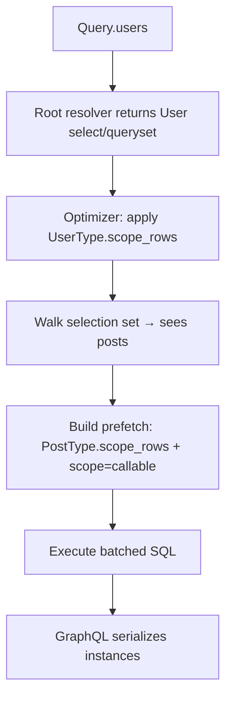

# strawberry-orm

[Tests](https://github.com/strawberry-graphql/strawberry-orm/actions/workflows/tests.yml)
[codecov](https://codecov.io/gh/strawberry-graphql/strawberry-orm)

Backend-agnostic schema generation for [Strawberry GraphQL](https://strawberry.rocks/) on top of Django ORM, SQLAlchemy, and Tortoise ORM.

> **Warning** — `strawberry-orm` is still in **alpha**. Expect breaking changes and incomplete APIs while the package stabilizes.

## Contents

**Start here:** [Installation](#installation) · [Quick start](#quick-start) · [Choose a backend](#choose-a-backend) · [How loading works](#how-loading-works)

**Before you ship:** [Security](#security) · [Production baseline](#production-baseline)

**Feature guide:** [Defining types](#defining-types) · [Declaring fields](#declaring-fields) · [Filters and ordering](#filters-and-ordering) · [Custom filters and ordering](#custom-filters-and-ordering) · [Grouping and aggregation](#grouping-and-aggregation) · [Payloads](#data--errors-payloads) · [Mutations](#mutations) · [Relay](#relay-integration) · [Async](#async-usage)

**Reference:** [API reference](API_REFERENCE.md) · [Backend options](#backend-options) · [Public exports](#public-exports) · [Full example](#appendix-full-example)

---

## Installation

```bash
uv add "strawberry-orm[sqlalchemy]"   # or [django] or [tortoise]
```

Or with pip:

```bash
pip install "strawberry-orm[sqlalchemy]"
```

Requires Python `>=3.12` and `strawberry-graphql>=0.311.0`.

## Quick start

Minimal blog API: users with published posts only. Assumes SQLAlchemy models `User` and `Post` where `Post.is_published` is a boolean. See [Choose a backend](#choose-a-backend) to wire session context.

```python
# SQLAlchemy
import strawberry
from strawberry_orm import StrawberryORM, auto

orm = StrawberryORM.for_sqlalchemy(
    dialect="postgresql",
    session_getter=lambda info: info.context["session"],
)

@orm.type(Post)
class PostType:
    id: auto
    title: auto

    @classmethod
    def scope_rows(cls, select, info):
        # hide drafts everywhere Post loads
        return select.where(Post.is_published.is_(True))

@orm.type(User)
class UserType:
    id: auto
    name: auto
    posts: list[PostType]

@strawberry.type
class Query:
    users: list[UserType] = orm.field.eager()

schema = orm.schema(query=Query)

QUERY = "{ users { name posts { title } } }"
# result = schema.execute_sync(QUERY, context_value={"session": session})
# → drafts excluded; only published post titles under each user
```

Drafts are hidden because `PostType.scope_rows` runs wherever Post rows load — including under `users`. [How loading works](#how-loading-works) explains why, and what you still have to configure yourself.

### The field declarations

`id: auto` and `posts: list[PostType]` above are the two you need most. Everything else is one of two forms, and the name tells you what the field costs.

**`eager`** is a field the optimizer can see through. **`lazy`** is your code, run once per parent row.

What separates them is whether your callable needs the parent row. A callable that takes `(query, info)` doesn't, so the library can fold it into a single query covering every parent. One that takes `self` does, and that forecloses the folding no matter how capable the backend is.

Usually that means `eager` costs one query and `lazy` costs one per parent, but the second half is not a rule: with `batch_relations` on, Django and SQLAlchemy collapse most `lazy` relation resolvers into a single query too. What `eager` guarantees is that no rewrite has to be *proven* — a scope cannot vary per parent, so it always folds. A `lazy` resolver whose predicate mentions the parent, slices per parent, or runs its own query gets no such promise. [Choosing between eager and lazy](#choosing-between-eager-and-lazy) has the measured comparison.

**On a type** — every field on an `@orm.type` class is one of these:

```python
# SQLAlchemy — see "Reading the examples" for the Django / Tortoise spelling
@orm.type(Post)
class PostType:
    # --- eager: one query for every parent --------------------------------------
    title: auto                                     # a column
    author: UserType                                # a relation, eager-loaded

    body: auto = orm.field.eager(                   # metadata on a resolved field
        permission_classes=[IsAdmin],               # field permissions
        description="Post body",                    # forwarded to Strawberry
    )
    tags: list[TagType] = orm.field.eager(
        filters=TagFilter, order=TagOrder,          # adds filter/order arguments
    )                                               # also: compute=, disable_optimization=

    @orm.field.eager                                # (query, info): narrows the
    def comments(select, info) -> list[CommentType]:            # relation, named
        return select.where(Comment.is_public.is_(True))        # for it

    # --- lazy: your resolver, once per parent row -------------------------------
    @orm.field.lazy                                 # returns rows: hand back the
    def recent(self, info: strawberry.Info) -> list[CommentType]:   # query itself,
        return select(Comment).where(Comment.post_id == self.id)    # unexecuted

    @orm.field.lazy(filters=CommentFilter)          # ...with filter/order arguments
    def searchable(self, info: strawberry.Info) -> list[CommentType]:
        return select(Comment).where(Comment.post_id == self.id)

    @orm.field.lazy(using=["author"])               # names the relation it reads,
    def byline(self, info: strawberry.Info) -> str: # so that loads with the parent
        return f"by {self.author.name}"             # and costs no extra query

    @strawberry.field                               # plain Strawberry, no ORM
    def slug(self, info: strawberry.Info) -> str:
        return self.title.lower().replace(" ", "-")


@orm.type(User)
class UserType:
    posts: list[PostType] = orm.field.eager(        # the inline spelling of
        lambda select, info: select.where(Post.is_published.is_(True))
    )
```

There is one scope per relation, and it carries that relation's name — `comments` above scopes `Post.comments`. A second, differently-filtered view is a `lazy` resolver.

**On the query root** — the same forms, minus a parent row:

```python
# SQLAlchemy
@strawberry.type
class Query:
    posts: list[PostType] = orm.field.eager()                      # generated resolver
    filtered: list[PostType] = orm.field.eager(filters=PostFilter) # ...with arguments

    @orm.field.lazy                                                # your own criteria
    def published(self, info: strawberry.Info) -> list[PostType]:
        return select(Post).where(Post.is_published.is_(True))

```

Each name has exactly one contract, and the library holds you to it. Hand `eager` a callable that takes `self` and it refuses, because a parent row is the one thing an eager field never sees:

```
byline(self, ...) is not a scope: a scope receives (query, info) and never
sees the parent row. Use orm.field.lazy for a resolver that needs self.
```

[Declaring fields](#declaring-fields) covers how to choose, what else the library checks, and the older spellings that still work.

### Connections

Relay connections use the same two names, but unlike fields the choice is not really yours — it follows from where the connection sits.

```python
# SQLAlchemy
from strawberry_orm.relay import ORMListConnection

@strawberry.type
class Query:
    # eager: an entry point over the whole table
    posts: ORMListConnection[PostType] = orm.connection.eager()

    # ...narrowed, the way a field scope narrows
    published: ORMListConnection[PostType] = orm.connection.eager(
        scope=lambda select, info: select.where(Post.is_published.is_(True))
    )


@orm.type(User)
class UserType:
    # lazy: hangs off a parent, so it runs once per user
    @orm.connection.lazy(ORMListConnection[PostType])
    def posts(self, info: strawberry.Info) -> list[PostType]:
        return select(Post).where(Post.author_id == self.id)
```

**At a query root, an eager connection covers the whole table.** On an `@orm.type` it is served by the parent's relation instead, and every parent's page is taken in a single query: rows are numbered within each parent by a window function and the low numbers kept, so `{ users { posts(first: 10) } }` costs one query for the pages and one for the counts, however many users there are.

```python
@orm.type(User)
class UserNode(relay.Node):
    id: relay.NodeID[int]
    posts: ORMListConnection[PostNode] = orm.connection.eager()
```

`totalCount` is each parent's own total, counted separately rather than read off the page — the page was truncated, so counting it would report the page size.

This needs a window function and a column on the related rows tying them to a parent, so it is refused when the type is defined if either is missing: on Tortoise, whose query builder has no window functions, and for a many-to-many, whose rows carry the parent key in the association table. Both point you at `orm.connection.lazy`, which is the honest spelling for one query per parent.

Note that a connection on a plain `@strawberry.type` is a *root* connection wherever it appears — it queries the whole table, because nothing about it knows a parent exists. Put connections over relations on an `@orm.type`.

Either form gives you cursor pagination, `totalCount`, and the `filter`, `order`, and `groupBy` arguments generated from the node type — with filters and ordering applied *before* the slice, so you always page through a correctly sorted set.

A `scope=` narrows `totalCount` and `aggregates` as well as `edges`. Those are computed from the query rather than from the rows you get back, so a scope that only reached `edges` would still tell a caller how many rows they are not allowed to see. [Connection fields](#connection-fields) has the rest.

---

## Choose a backend

Every backend generates the same schema; they differ in how the session reaches a resolver.


| Backend    | Constructor                                                     | Session                                                                                                                                        |
| ---------- | --------------------------------------------------------------- | ---------------------------------------------------------------------------------------------------------------------------------------------- |
| Django     | `StrawberryORM.for_django(...)`                                 | Implicit — Django querysets manage their own connection.                                                                                       |
| SQLAlchemy | `StrawberryORM.for_sqlalchemy(dialect=..., session_getter=...)` | Resolved per request from `session_getter`, `info.context["session"]`, `info.context.session`, or `info.context.get_session()`. Sync or async. |
| Tortoise   | `StrawberryORM.for_tortoise(...)`                               | Implicit, but async-only — `await` in resolvers, and see [Async usage](#async-usage).                                                          |


Sync and async execution both work on Django; a custom async resolver that touches the ORM directly still needs `sync_to_async(...)`.

Every constructor takes the same tuning options — limits, warnings, optimizer switches. They are listed under [Backend options](#backend-options); the defaults are safe to start with.

### Reading the examples

Everything `strawberry-orm` generates — types, filters, ordering, grouping, mutations — is identical across the three backends. What differs is the query object your own callables receive and return, in exactly one place: whenever you write a `scope_rows`, a `scope=`, or a resolver that returns rows.


|                          | Django                               | Tortoise                             | SQLAlchemy                                      |
| ------------------------ | ------------------------------------ | ------------------------------------ | ----------------------------------------------- |
| What you receive         | `QuerySet`                           | `QuerySet`                           | `Select`                                        |
| Idiomatic parameter name | `queryset`                           | `queryset`                           | `select`                                        |
| Narrow rows              | `queryset.filter(is_published=True)` | `queryset.filter(is_published=True)` | `select.where(Post.is_published.is_(True))`     |
| Exclude rows             | `queryset.exclude(title="x")`        | `queryset.exclude(title="x")`        | `select.where(Post.title != "x")`               |
| Order                    | `queryset.order_by("name")`          | `queryset.order_by("name")`          | `select.order_by(Tag.name)`                     |
| Rows for one parent      | `Post.objects.filter(author=self)`   | `Post.filter(author_id=self.id)`     | `select(Post).where(Post.author_id == self.id)` |
| Everything for a model   | `orm.get_default_queryset(Post)`     | `orm.get_default_queryset(Post)`     | `orm.get_default_queryset(Post)`                |


Each code block below says which backend it is written in. Where only the query expression differs, translate it with this table rather than expecting a different API.

---

## How loading works

> **The one rule:** the optimizer can only add loads while the query is unexecuted. The first value that materializes ends optimization for everything beneath it.

Returning `list(...)`, `.first()`, or already-loaded instances from a field means nothing below it can be eager-loaded or scoped. Every behaviour in this chapter follows from that.

Three layers are involved. Your Strawberry types and the client's selection set decide *what* is asked for; the optimizer mounted by `orm.schema()` turns that into loads and applies scoping; the ORM backend runs the SQL.

### Resolution flow

For `{ users { name posts { title } } }`:

1. `Query.users` returns a User queryset/select. `**UserType.scope_rows**` may filter it — including joins on related tables, which only affects *which users match*.
2. The optimizer walks the selection set and sees `posts` under `users`.
3. To build the prefetch it calls `**PostType.scope_rows**`, plus any `scope=` on `UserType.posts`. This is a separate scoping step for Post rows, not a re-run of `UserType.scope_rows`.
4. One batched query loads the users and their scoped posts.
5. GraphQL reads `user.posts` from the prefetched data. No further scoping pass happens on Django or SQLAlchemy for plain annotation relations.




### `scope_rows` — one model, one type

`scope_rows` is the row-access boundary for a model: it is handed the query about to run and returns a narrowed one. It pairs with the field-level `[orm.field.eager](#the-two-kinds-of-field)` — same idea, one on the type, one on a single relation edge.

```python
@orm.type(Post)                          # Django / Tortoise
class PostType:
    id: auto
    title: auto

    @classmethod
    def scope_rows(cls, queryset, info):
        return queryset.filter(is_published=True)


@orm.type(Post)                          # SQLAlchemy
class PostType:
    id: auto
    title: auto

    @classmethod
    def scope_rows(cls, select, info):
        return select.where(Post.is_published.is_(True))
```

The hook is always called positionally, so **name the parameter after whatever your ORM actually hands you**:


| Backend               | Idiomatic                             | What arrives |
| --------------------- | ------------------------------------- | ------------ |
| Django                | `def scope_rows(cls, queryset, info)` | `QuerySet`   |
| Tortoise              | `def scope_rows(cls, queryset, info)` | `QuerySet`   |
| SQLAlchemy            | `def scope_rows(cls, select, info)`   | `Select`     |
| Backend-agnostic code | `def scope_rows(cls, query, info)`    | whichever    |


Define it on the `@orm.type` class for the model **being loaded**. A nested query runs one hook per model, not one hook for the whole path:


| Query                    | Root rows             | Nested relation       |
| ------------------------ | --------------------- | --------------------- |
| `posts { … }`            | `PostType.scope_rows` | —                     |
| `users { posts { … } }`  | `UserType.scope_rows` | `PostType.scope_rows` |
| `posts { author { … } }` | `PostType.scope_rows` | `UserType.scope_rows` |


> Renamed from `get_queryset` in 0.15. The old name named a Django type that only two of the three backends use, and `get_` suggested it returns a fresh query rather than narrowing the one it is handed. `warn_missing_queryset` is now `warn_missing_scope`.

### Parent scoping does not flow to children

This is the mistake that bites hardest, so it is worth one careful example.

`users { posts { … } }` looks like a single tree, but the ORM loads it in two steps: User rows first, then Post rows. A filter on the parent type restricts *which parents come back*. It does not restrict the children — **even when that filter joins the child table.**

```python
# Django
@orm.type(User)
class UserType:
    id: auto
    name: auto
    posts: list[PostType]

    @classmethod
    def scope_rows(cls, queryset, info):
        return queryset.filter(posts__is_published=True).distinct()

@orm.type(Post)
class PostType:
    id: auto
    title: auto
    # no scope_rows
```

Given this data:


| User  | Post              | is_published |
| ----- | ----------------- | ------------ |
| Alice | "Hello world"     | true         |
| Alice | "Secret draft"    | false        |
| Bob   | "Bob's only post" | false        |


`{ users { name posts { title } } }` returns:

```json
{
  "users": [
    { "name": "Alice", "posts": [{ "title": "Hello world" }, { "title": "Secret draft" }] }
  ]
}
```

Bob is gone, because the parent filter asked *does this user have a published post* — and Alice does. But the draft is still there: loading Post rows never consulted `UserType.scope_rows` again, and `PostType` has no scope of its own. The join tested **existence**; it did not filter the child rows.

The fix is to scope the model wherever it loads:

```python
# Django
@orm.type(Post)
class PostType:
    id: auto
    title: auto

    @classmethod
    def scope_rows(cls, queryset, info):
        return queryset.filter(is_published=True)
```

Now `{ posts { title } }` and `{ users { posts { title } } }` both hide drafts. The same reasoning covers tenant IDs, soft deletes, and permissions: **scope every model type a client can reach**, and never assume a parent join stands in for a child scope.


| Goal                                  | Where it belongs                          |
| ------------------------------------- | ----------------------------------------- |
| Hide users with no published posts    | `UserType.scope_rows`, joining on `posts` |
| Hide draft posts under every user     | `PostType.scope_rows`                     |
| Hide drafts on one relation edge only | `scope=` on `UserType.posts`              |
| Both parent and child                 | Both hooks — they are independent         |


### Resolver kinds

How a field is written decides what scoping it gets.


| Field                                       | Scoping                                                                                                            |
| ------------------------------------------- | ------------------------------------------------------------------------------------------------------------------ |
| `users: list[UserType] = orm.field.eager()` | Optimizer + `UserType.scope_rows`                                                                                  |
| `posts: list[PostType]` (annotation)        | Related type's `scope_rows`, loaded by prefetch                                                                    |
| `orm.field.eager(…)` with a scope           | Composes **after** the related type's `scope_rows`                                                                 |
| `@orm.field.lazy` returning a query object  | Optimizer + that type's `scope_rows` — see [Root custom query](#root-custom-query)                                 |
| `@orm.field.lazy` returning `self.author`   | As written; scoping only via prefetch                                                                              |
| `@strawberry.field`, fully custom           | You own scoping and auth                                                                                           |
| A resolver returning instances              | Nested relations scoped and eager-loaded — see [Rows a resolver already fetched](#rows-a-resolver-already-fetched) |


The first four rows are all `orm.field`, which has two named forms that differ in what they cost — see [The two kinds of field](#the-two-kinds-of-field).

Type-level and field-level scopes compose in that order — `scope_rows` first, then `scope=` — and both run **before SQL executes**.

Relation scoping does not depend on the optimizer. When the optimizer runs it applies the scope once while building the eager load; when it does not, the scope is applied again as each parent's relation is read. Either way the rows are scoped — the difference is how many queries it takes. The **root** field is the exception: `scope_rows` on a root query object is applied by the optimizer, so build with `orm.schema()`.

### Root custom query

A root `Query` field returns rows directly rather than through a relation. With `orm.schema()`, returning an *unexecuted* select or queryset still engages the optimizer: your filter composes with `UserType.scope_rows`, and nested fields still get their own type's hook at prefetch time.

```python
# SQLAlchemy
@strawberry.type
class Query:
    @orm.field.lazy
    def active_users(self, info: strawberry.Info) -> list[UserType]:
        return select(User).where(User.is_active.is_(True))   # ✓ query object
        # return session.scalars(...).all()                   # ✗ materialized
```

Use `scope_rows` when the same rule applies everywhere the model loads, and a custom root resolver when the criteria belong to that one entry point. See [List Fields](#list-fields) for a comparison.

### Rows a resolver already fetched

A resolver that returns rows rather than a query object gives the optimizer nothing to add eager loads to. It handles that case anyway: the rows are all it needs, so it loads their relations onto them.

```python
# Django
@strawberry.field
def create_post(self, info: strawberry.Info, ...) -> PostType:
    return Post.objects.create(...)      # relations below still eager-loaded
```

This reaches rows nested inside a wrapper too. A payload's `data` is a resolved field in its own right, so the rows arrive with exactly the selection that describes them.

Relations are loaded **onto the rows you returned**, so a value you just set in memory is never overwritten by a re-read of the database — the mutation above reports the title it wrote, not the one in the database.

`orm.optimize` — the manual form

Rows that never pass through a resolver's return value are out of reach, and for those there is `orm.optimize(data, info)`. It takes a query object, a model instance, or a list, and returns anything else untouched.

```python
# Django
rows = list(Post.objects.filter(...))
orm.optimize(rows, info)
```

Calling it on rows the optimizer already prepared costs nothing. `at="data"` re-roots the selection when the rows sit below the resolved field; `at` also takes a sequence for a deeper path and matches either `camelCase` or `snake_case`. Getting it wrong is not an error — nothing is eager-loaded and the rows come back as they would have anyway.


### `orm.schema()`

Build schemas with `orm.schema()`. The optimizer is enabled by default: it executes query objects, eager-loads relations from the selection set, applies field hints, and honours `scope_rows`. On Django and SQLAlchemy nested scoping depends on it, so this is not an optional performance tweak.

```python
schema = orm.schema(query=Query, mutation=Mutation)
schema = orm.schema(query=Query, extensions=[MyCustomExtension()])

schema = orm.schema(query=Query, optimizer=False)              # opt out per schema
orm = StrawberryORM.for_sqlalchemy(enable_optimizer=False, …)  # or globally
```

#### Telling the optimizer what to load

The optimizer follows the selection set, so a relation the client asks for is prefetched without you saying anything. Two cases it cannot see:

```python
@orm.type(Post)
class PostType:
    # a resolver reads a relation the query never selected
    @orm.field.lazy(using=["author"])
    def byline(self, info: strawberry.Info) -> str:
        return f"by {self.author.name}"

@orm.type(User)
class UserType:
    # only some of the related rows should load
    posts: list[PostType] = orm.field.eager(scope=lambda qs, info: qs.filter(is_published=True))
```

`using=` answers *what to load*, `scope=` answers *which rows*. Both run while the prefetch is built, so `using=["author"]` becomes `select_related` on Django, `joinedload` / `selectinload` on SQLAlchemy, and `prefetch_related` on Tortoise — one query, not one per row.

A `scope=` callable receives `(qs, info)` and never the parent instance, which is exactly what lets the optimizer hoist it. When the query really does depend on the parent row, write a resolver instead.

Names are validated when the type is defined, so a typo fails immediately rather than silently doing nothing:

```
ValueError: PostType.byline: Post has no relation 'athor'. Did you mean 'author'?
```

See [Declaring fields](#declaring-fields) for the full set of forms and arguments.

#### Relation batching

A resolver on a relation field runs once per parent row, so `{ users { posts { … } } }` over 250 users is 251 statements. When the resolver returns an unexecuted query, the optimizer rewrites that into one statement per *query shape*:

```python
# Django
@orm.type(User)
class UserType:
    name: auto

    @strawberry.field
    def posts(self, info: strawberry.Info) -> list[PostType]:
        return Post.objects.filter(author=self, is_published=True)
```


| Parents | Without batching | With batching |
| ------- | ---------------- | ------------- |
| 3       | 5 statements     | 3             |
| 53      | 55 statements    | 3             |
| 253     | 255 statements   | 3             |


Parents are already in memory and building a queryset touches no database, so the resolver runs for every sibling parent up front, the parent predicate is reflected out of each query, and the remainders are grouped. Branching therefore costs one statement per branch rather than one per row:

```python
# Django
if self.is_admin:
    return Post.objects.filter(author=self)
return Post.objects.filter(author=self, is_published=True)
```

Batched queries take the same optimizer path as per-row ones, so the child type's `scope_rows` and `scope=` still apply. Turn it off with `batch_relations=False`.

When batching declines to rewrite

It falls back to per-row resolution — never to wrong rows — when:

- the parent key sits inside an `OR` arm, or is reached through a join
- the query is sliced, since a per-parent `LIMIT` needs a window function
- the resolver executed its own query: `list(...)`, `.first()`, `.count()`
- the backend is Tortoise, whose query internals are not stable to introspect

A resolver embedding a per-parent literal such as `created_at__gte=self.joined_at` stays correct but forms one group per distinct value, so it may not reduce the count.


Edge cases and diagnostics

**Tracing hook order.** Add `print(..., flush=True)` inside your hooks:

```python
# Django
@classmethod
def scope_rows(cls, queryset, info):
    print("SCOPE:PostType.scope_rows", flush=True)
    return queryset.filter(is_published=True)

posts: list[PostType] = orm.field.eager(
    lambda qs, info: (
        print("SCOPE:UserType.posts.load", flush=True) or qs.filter(title != "GraphQL Guide")
    )
)
```

For `{ users { name posts { title } } }` the order is always `PostType.scope_rows` then `UserType.posts.load`. With a plain annotation and no `scope=`, only the first line appears. When the relation was eager-loaded, the hooks run once for the whole batch; when it was not, they run again for each parent as the relation is read. Either way they run. The repo asserts this by patching `print` — see `tests/backends/*/test_query_scoping_hook_order.py`.

**Fragments.** The optimizer walks inline fragments (`... on PostType`) and named fragment spreads, so relations inside them are prefetched normally.

**Field permissions.** `orm.field.eager(permission_classes=[...])` — see [Declaring fields](#declaring-fields).


> If nested rows come back unscoped, check that `scope_rows` exists on every exposed type. Scoping does not depend on the optimizer: a resolver returning a list is slower than one returning a query object, but it is not less scoped. See [Security](#security).

---

## Security

`strawberry-orm` has safety-focused defaults, but schema design determines what clients can read and write.

### What the library does by default

- `orm.input()`, `orm.filter()`, and `orm.order()` exclude sensitive-looking fields (`password_hash`, `api_key`, `role`, `is_admin`, etc.)
- String regex filters are disabled by default
- Filter depth, branch count, and `inList` size are capped
- `orm.ref()` provides explicit `unlink` and `delete` operations — both opt-in via `unlink=True` and `delete=True`
- When you use `orm.schema()` (optimizer enabled by default), nested relation loads honor each type's `scope_rows` — but **only for types where you define it** (the ORM warns at type registration when `scope_rows` is missing)
- Filtering through a relation (`filter: { object: { author: … } }`) is restricted to the rows the related type's `scope_rows` allows, so a filter cannot confirm values on rows the caller cannot read
- Ordering through a relation into a scoped type is **rejected when `orm.schema()` builds**, because the resulting sequence would itself rank hidden rows — see [Ordering into a scoped type](#ordering-into-a-scoped-type)
- Connection `aggregates` and `groups` are computed with the type's `scope_rows` applied, so counts and sums cover only readable rows

### Your responsibility


| Concern          | Library                       | You                                                                                                                                      |
| ---------------- | ----------------------------- | ---------------------------------------------------------------------------------------------------------------------------------------- |
| Authentication   | —                             | middleware, `info.context`, permission classes                                                                                           |
| Row access       | `scope_rows` per exposed type | define on **every** model type clients can reach — [parent scoping does not flow to children](#parent-scoping-does-not-flow-to-children) |
| Column exposure  | —                             | `exclude=[...]` on `@orm.type`, or `orm.field.eager(permission_classes=…)`                                                                |
| Query size       | —                             | `default_query_limit`                                                                                                                    |
| Mutations        | —                             | auth in resolvers; `authorize` callback on `apply_ref_list`                                                                              |
| Custom resolvers | —                             | same as hand-written DB access — you own scoping                                                                                         |


### Ordering into a scoped type

Filtering through a relation can be made safe by restricting the join — hidden rows simply never match. Ordering cannot: every row still has to stand somewhere in the sequence, and its position leaks the hidden sort key. If visible authors bracket a hidden one alphabetically, the caller has learned something about a row they cannot read.

So if an order input can sort through a relation whose target type defines `scope_rows`, `orm.schema()` refuses to build:

```
Cannot order by Post.author: User is scoped by scope_rows, so ordering would
rank rows the caller cannot read. Order by a column on Post, or pass
allow_scoped_ordering=['author'] when building the order type for Post if every
readable Post is guaranteed to have a readable User.
```

Three ways forward:

```python
# 1. Sort by a column on the row itself (also faster — no join)
@orm.order_type(Post)
class PostOrder:
    title: auto
    author_name: auto        # denormalized onto Post

# 2. Opt in, per relation, when the scope is a partition your rows can't cross
#    (e.g. tenancy: every readable Post already has a readable author)
@orm.order_type(Post, allow_scoped_ordering=["author"])
class PostOrder:
    title: auto
    author: auto

# 3. Take ownership with a custom order field — the library does not second-guess
#    hand-written callbacks, so the scoping decision is yours
@orm.order_type(Post)
class PostOrder:
    title: auto

    @order_field
    def by_author(self, query, value, info): ...
```

`allow_scoped_ordering` only lifts the ordering restriction for the relations you name, on that one order input. `scope_rows` keeps scoping reads and filter traversal exactly as before, and another order input over the same model is unaffected. Naming a relation the order input cannot sort through is an error, so typos fail loudly.

If you build with `strawberry.Schema` directly instead of `orm.schema()`, the build-time check does not run; the offending query is rejected at execution instead.

### Common mistakes

Each one links to the mechanics.


| Mistake                                                                                          | Why it leaks                                           | Where                                                                                 |
| ------------------------------------------------------------------------------------------------ | ------------------------------------------------------ | ------------------------------------------------------------------------------------- |
| Parent `scope_rows` used to scope children, including via a join like `posts__is_published=True` | Tests existence of a child, does not filter children   | [Parent scoping does not flow to children](#parent-scoping-does-not-flow-to-children) |
| A relation resolver that materializes — `list(self.posts.all())`, `.first()`                     | Skips `scope_rows` and the optimizer entirely          | [Resolver kinds](#resolver-kinds)                                                     |
| `strawberry.Schema` instead of `orm.schema()`                                                    | Nested scoping hooks never run on Django or SQLAlchemy | `[orm.schema()](#ormschema)`                                                          |
| A root resolver returning instances                                                              | Optimizer cannot prefetch or scope anything below      | [Root custom query](#root-custom-query)                                               |
| `scope_rows` that ignores `info.context`                                                         | Hardcoded tenant or user filters leak across requests  | `[scope_rows](#scope_rows--one-model-one-type)`                                       |
| `@orm.type` exposing secrets through `auto`                                                      | Output types do not hide sensitive columns for you     | [Defining Types](#defining-types)                                                     |


```python
# Django; translate the query expressions with "Reading the examples"
return list(self.posts.all())            # ✗ materialized: no scope_rows, no optimizer
return self.posts.all()                  # ✓ scoped, and batched into one statement

schema = strawberry.Schema(query=Query)  # ✗ nested hooks never run
schema = orm.schema(query=Query)         # ✓ optimizer and scoping active

return list(User.objects.all())          # ✗ optimizer skipped for everything below
return orm.get_default_queryset(User)    # ✓ still a query object

return queryset.filter(tenant_id=1)                             # ✗ same tenant always
return queryset.filter(tenant_id=info.context["tenant_id"])     # ✓ per-request scope
```

Better than a filtering resolver is no resolver at all, so the relation stays a single prefetch:

```python
posts: list[PostType] = orm.field.eager(lambda qs, info: qs.filter(is_published=True))
```

And keep secrets off output types explicitly:

```python
@orm.type(User, exclude=["password_hash", "api_key"])
class UserType:
    id: auto
    name: auto
```

### Production baseline

```python
orm = StrawberryORM.for_sqlalchemy(
    dialect="postgresql",
    session_getter=lambda info: info.context["session"],
    default_query_limit=100,
    max_filter_depth=8,
    max_filter_branches=25,
    max_in_list_size=200,
)

schema = orm.schema(query=Query)  # optimizer on by default
```

---

## Defining types

Relation fields load the **related** model; scoping is per type — see [How loading works](#how-loading-works).

### `@orm.type(Model)`

```python
from strawberry_orm import auto

@orm.type(User)
class UserType:
    id: auto
    name: auto
    email: auto
```

`auto` is an alias for `strawberry.auto`. The backend inspects the model and resolves the Python type for each field.

Keyword arguments: `include`, `exclude`, `name`, `filters`, `order`.

```python
@orm.type(User, exclude=["password_hash", "api_key"], name="PublicUser")
class PublicUserType:
    id: auto
    name: auto
    email: auto
```

### Relations

Reference other generated types directly. The backend auto-generates resolvers for relationship fields:

```python
@orm.type(Post)
class PostType:
    id: auto
    title: auto
    tags: list[TagType]
```

If the nested type carries `filters` and/or `order`, list relations expose those arguments automatically.

### `orm.input(Model)` and `orm.partial(Model)`

Generate input types from model metadata:

```python
CreateUserInput = orm.input(User, include=["name", "email"])
UpdateUserInput = orm.partial(User, include=["name", "email"])
```

`input()` and `partial()` share the same signature: `include`, `exclude`, `exclude_pk` (default `True`), `name`. Fields are optional (defaulting to `strawberry.UNSET`), skip relations, exclude primary keys by default, and exclude sensitive-looking fields unless explicitly included.

---

## Declaring fields

A field is either **declared** — the library resolves it — or **written** by you. Which one you pick decides when your code runs and what it can see.

### The two kinds of field

`orm.field` has two named forms. The name tells you **what the field costs**, which follows from whether your code needs the parent row:


|                                | You supply   | Runs                              | Receives        |
| ------------------------------ | ------------ | --------------------------------- | --------------- |
| `orm.field.eager()`            | metadata     | once, while the prefetch is built | —               |
| `orm.field.eager(...)`         | a narrowing  | once, while the prefetch is built | `(query, info)` |
| `orm.field.lazy`             | the resolver                   | once per parent row | `(self, info)` |
| `orm.field.lazy(using=[...])` | the resolver, and what it reads | once per parent row | `(self, info)` |


`eager` never sees a parent row. That absence is the point: with no parent to look at, the optimizer folds the field into a single prefetch covering every parent at once. It also makes a field-level scope symmetric with `scope_rows(cls, query, info)`.

`using=` belongs on `lazy` and nowhere else. It exists to disclose relations the optimizer cannot see being read, and only a resolver hides anything — an eager field is either written by the library from the selection set or handed back by your scope as a query the ORM reads in full. A `lazy(using=[...])` field still runs once per row, but the relations it names load with the parent, so those reads cost nothing.

```python
# Django
@orm.type(User)
class UserType:
    id: auto
    name: auto

    # the library resolves it; you add metadata
    email: auto = orm.field.eager(permission_classes=[IsAdmin])

    # you narrow which rows load — named for the relation it narrows
    @orm.field.eager
    def posts(queryset, info) -> list[PostType]:
        return queryset.filter(is_published=True)

    # you write the resolver; the library cannot see inside it
    @orm.field.lazy
    def recent(self, info: strawberry.Info) -> list[PostType]:
        return Post.objects.filter(author_id=self.id)

    # ...and you say what it reads, so that loads with the parent
    @orm.field.lazy(using=["comments"])
    def comment_count(self, info: strawberry.Info) -> int:
        return len(self.comments)
```

A scope takes the **name of the relation it narrows** — `posts` above scopes `User.posts`. Unless you say otherwise with `on=`, a field is served by the relation sharing its name, and pointing `using=` at a relation you have also scoped asks for the same prefetch twice with different querysets, which Django rejects outright.

#### `on=` — a field named something other than its relation

By default the field name *is* the relation name, which means a relation can back only one field. `on=` lifts that: it names the relation the rows come from, so the GraphQL field can be called whatever suits your API, and one relation can have several views.

```python
# Django
@orm.type(User)
class UserType:
    published: list[PostType] = orm.field.eager(
        on="posts", scope=lambda qs, info: qs.filter(is_published=True)
    )
    drafts: list[PostType] = orm.field.eager(
        on="posts", scope=lambda qs, info: qs.filter(is_published=False)
    )
```

Both views load in one query each — three queries for the whole result set above, however many users there are — and each keeps its own scope. Without `on=` the second view would have to be a `lazy` resolver, costing a query per user.

`on=` is required whenever the names differ; there is no guessing from `published_posts` to `posts`, and guessing wrong on something that controls which rows a caller sees is not worth the convenience. A name that isn't a relation fails when the type is defined:

```
ValueError: UserType.published: on='postz' names the relation this field is
served from, but User has no relation 'postz'. Did you mean 'posts'?
```

**Backend support.** Serving two views of one relation needs somewhere to put the second, and the backends differ:

| Backend | How | Available |
| --- | --- | --- |
| Django | `Prefetch(to_attr=...)` loads each view into its own attribute | yes |
| SQLAlchemy | loader options fill the mapped attribute, so the batcher collapses per-parent statements instead | yes, except through an association table |
| Tortoise | neither a `to_attr` equivalent nor relation batching | no — refused at schema-build time |

Where it cannot be eager the library says so when the type is defined rather than quietly costing you a query per row, and points you at `orm.field.lazy`, which is the honest spelling for that.

#### Decorator or inline — the same call

`@decorator` is sugar for `name = decorator(fn)`, so every form has an inline spelling. Only the source of the field's type changes:

```python
@orm.field.eager                                   # type ← return annotation
def posts(qs, info) -> list[PostType]:
    return qs.filter(is_published=True)

posts: list[PostType] = orm.field.eager(           # type ← variable annotation
    lambda qs, info: qs.filter(is_published=True)
)
```

Inline is better for one-liners, and it is the only way to **share** a scope:

```python
def published_only(qs, info):
    return qs.filter(is_published=True)

class UserType:
    posts: list[PostType] = orm.field.eager(published_only)

class TagType:
    posts: list[PostType] = orm.field.eager(published_only)
```

#### Choosing between `eager` and `lazy`

Both end up applying the child type's `scope_rows`, but they are not equivalent. Same query, same data, with `PostType.scope_rows` hiding drafts:


| `UserType.posts` written as            | Queries | Drafts hidden |
| -------------------------------------- | ------- | ------------- |
| `posts: list[PostType]`                | 2       | yes           |
| `orm.field.eager(…)` with a scope      | 2       | yes           |
| `orm.field.lazy` returning a queryset  | 3       | yes           |
| `orm.field.lazy` returning `list(...)` | 5       | **no**        |


`lazy` costs an extra query because the optimizer had already built the prefetch from the selection set; your resolver ignores it and runs its own. Batching keeps that at one statement rather than one per parent, but cannot remove it.

Those counts assume the batcher can rewrite your resolver's query, which it manages for a plain, filtered, ordered or excluded relation read. It cannot when the parent appears in the predicate beyond the foreign key, when the parent key sits in an `OR` arm, when the resolver slices per parent, or when it runs its own query — each of those is a query per parent however the field is written. Nor can it on Tortoise, which has no rewrite at all, or with `batch_relations=False`. So the gap between the first two rows and the third widens to N wherever the rewrite does not hold, and a scope is the only one of them that cannot vary per parent and therefore never needs the rewrite.

The last row is the one to remember: a scope has no way to lose the scope, because it receives a query and returns a query. `lazy` is one `list(...)` away from silently returning rows the type exists to hide. Reach for `lazy` only when the query genuinely depends on the parent row or on `info`.

#### What the library checks

Because the name declares the shape, mistakes are caught when the class is defined rather than deep inside a prefetch:

```python
@orm.field.eager
def posts(self, info) -> list[PostType]: ...
# TypeError: posts(self, ...) is not a scope: a scope receives (query, info)
# and never sees the parent row. Use orm.field.lazy for a resolver that
# needs self.
```

It also rejects a `lazy` resolver without `self`, a scope with no type on either the annotation or the function, and `scope=` on a field that is not a relation on the model.

#### Metadata arguments

`eager` carries everything the optimizer needs to know about a field it resolves for you:


| Argument                               | Meaning                                                                                                                                 |
| -------------------------------------- | --------------------------------------------------------------------------------------------------------------------------------------- |
| `scope=callable`                       | Narrow the rows on this relation edge; composes after `scope_rows`. The keyword spelling of handing `eager` a `(query, info)` callable. |
| `filters=` / `order=`                  | Add `filter` / `order` arguments to the field.                                                                                          |
| `compute={...}`                        | Computed-column hints for the optimizer store.                                                                                          |
| `disable_optimization=True`            | Skip optimization for that field.                                                                                                       |
| `permission_classes=[...]`             | Field permissions.                                                                                                                      |
| `description=` / `deprecation_reason=` | Forwarded to Strawberry.                                                                                                                |


`scope=` answers *which rows*. Its counterpart, `using=`, answers *what to load* and lives on `orm.field.lazy`, because that is the only place with a resolver whose reads the optimizer cannot follow. You do not need `using=["posts"]` when the client already selects `posts { … }` — the optimizer follows the selection set either way.

#### Knowing when the collapse did not happen

A declaration cannot tell you whether the batcher actually collapsed a field, because that depends on the query's shape at runtime. It reports the ones it could not, through the same `lazy_resolution` diagnostic that flags unoptimized loads:

```
Unoptimized relation loads detected (1 total, 1 unique) — may waterfall (N+1):
  - path: users.written
    fell back to one query per parent: the resolver ran its own query,
      leaving nothing to rewrite
    fix: narrow it with a scope on orm.field.eager, which cannot vary per
      parent and so never needs rewriting
```

You get one of these when a resolver materializes its own rows, when the query cannot be rewritten to cover every parent at once, and on backends that answer asynchronously or have no rewrite at all. It is the counterpart to the guarantee `eager` gives you: where the name cannot promise a single query, the diagnostic tells you what really happened.

Names are validated when the type is defined, so a typo fails immediately:

```
ValueError: PostType.byline: Post has no relation 'athor'. Did you mean 'author'?
```

Migrating from 0.14

These spellings were removed in 0.15; there are no deprecation shims.


| 0.14                                  | 0.15                                   |
| ------------------------------------- | -------------------------------------- |
| `@orm.field` (bare)                   | `@orm.field.custom`                    |
| `orm.field()`, `orm.field(filters=…)` | `orm.field.auto(...)`                  |
| `orm.field(hint=…, scope=…)`          | `orm.field.auto(using=…, scope=…)`     |
| `make_field(permission_classes=…)`    | `orm.field.auto(permission_classes=…)` |
| `@orm.computed_field(hint=…)`         | `@orm.field.computed(using=…)`         |
| `hint=[...]`                          | `using=[...]`                          |
| `load=[...]` / `load=callable`        | `using=[...]` / `scope=callable`       |
| `only=[...]`                          | removed — every column loads           |
| `get_queryset(cls, qs, info)`         | `scope_rows(cls, query, info)`         |
| `warn_missing_queryset=`              | `warn_missing_scope=`                  |
| `scope=lambda qs: …`                  | `scope=lambda qs, info: …`             |


Migrating to 0.19

`orm.field` and `orm.connection` each collapsed to two names. The old ones still work.

| Before | Now |
| --- | --- |
| `orm.field.auto(...)` | `orm.field.eager(...)` |
| `orm.field.scoped(fn)` | `orm.field.eager(fn)` |
| `orm.field.custom(fn)` | `orm.field.lazy(fn)` |
| `orm.field.computed(fn, using=…)` | `orm.field.lazy(fn, using=…)` |
| `orm.field.auto(using=…)` | drop it — see below |
| `orm.connection(...)` | `orm.connection.eager()` / `.lazy(resolver=…)` |

Two behaviour changes worth knowing about:

- `using=` is gone from `eager`. It exists to disclose relations the optimizer cannot see being read, and only a resolver hides anything, so it now lives on `lazy` alone. `auto(using=…)` still works and still registers the hint, as it always did.
- `orm.connection` used to accept and ignore any keyword it did not recognise, so a misspelled or unsupported one silently did nothing. Unknown keywords now raise, and `scope=` genuinely narrows the connection — including `totalCount` and `aggregates`, not just `edges`.

### List fields

`orm.field.eager()` builds a list resolver from the model attached to the return type:

```python
@strawberry.type
class Query:
    users: list[UserType] = orm.field.eager()
```

For a root field with custom criteria, return an unexecuted select/queryset from `@orm.field.lazy` — still optimized by `orm.schema()`. See [Root custom query](#root-custom-query).

Define row scope on the type with `scope_rows` — see `[scope_rows](#scope_rows--one-model-one-type)` and the [Quick Start](#quick-start).

## Filters and ordering

Filters narrow rows **within** a type's query; they do not replace `scope_rows` — see [Security](#security) and [How loading works](#how-loading-works).

### Filters

Generate a filter input and attach it to a type:

```python
UserFilter = orm.filter(User)

@orm.type(User, filters=UserFilter)
class UserType:
    id: auto
    name: auto
    email: auto
```

List fields returning `UserType` then accept a `filter` argument:

```graphql
{
  users(filter: { field: { name: { exact: "Alice" } } }) {
    id
    name
  }
}
```

#### Filter shape

Filters are recursive `@oneOf` trees supporting `field`, `all`, `any`, `not`, and `oneOf`:

```graphql
# OR
{ users(filter: { any: [
    { field: { name: { exact: "Alice" } } }
    { field: { name: { exact: "Bob" } } }
] }) { name } }

# AND
{ posts(filter: { all: [
    { object: { author: { field: { id: { exact: 1 } } } } }
    { field: { isPublished: { exact: true } } }
] }) { title } }

# NOT
{ users(filter: {
    not: { field: { email: { contains: "example.com" } } }
}) { name } }
```

Built-in lookup types

`StringLookup`, `BooleanLookup`, `IDLookup`, `IntComparisonLookup`, `FloatComparisonLookup`, `DateComparisonLookup`, `TimeComparisonLookup`, `DateTimeComparisonLookup`

Typical string lookups: `exact`, `neq`, `contains`, `iContains`, `startsWith`, `iStartsWith`, `endsWith`, `iEndsWith`, `inList`, `notInList`, `isNull`.

Regex lookups (`regex`, `iRegex`) are disabled by default. Enable with `enable_regex_filters=True`.


#### Object traversal

When filters are registered for related models, the generated filter gains an `object` key for filtering by conditions on related objects:

```python
UserFilter = orm.filter(User)
PostFilter = orm.filter(Post)   # Post has an "author" relation to User
```

```graphql
{
  posts(filter: {
    object: { author: { field: { name: { exact: "Alice" } } } }
  }) { title }
}
```

Object traversal composes with boolean operators and supports multi-level nesting when intermediate models also have registered filters:

```graphql
# Comments on posts written by Alice
{
  comments(filter: {
    object: { post: {
      object: { author: { field: { name: { exact: "Alice" } } } }
    } }
  }) { body }
}
```

The `object` type is `@oneOf`. Relations only appear in `object` if their target model already has a registered filter at the time `orm.filter()` is called -- register leaf models first.

#### Filter projection

Pass `project={...}` to control which relations appear in `object` and how deep traversal can go:

```python
UserFilter    = orm.filter(User)
TagFilter     = orm.filter(Tag)
CommentFilter = orm.filter(Comment)

PostFilter = orm.filter(Post, project={"author": {}})  # only author, not tags/comments
```

Sub-project dicts control nested traversal. `{}` means "include as a leaf" (no further object traversal). A non-empty dict lists reachable relations:

```python
CommentFilter = orm.filter(Comment, project={
    "post": {"author": {}},   # Comment -> post -> author (but not post -> tags)
})
```


| `project` value           | Behavior                                           |
| ------------------------- | -------------------------------------------------- |
| `None` (default)          | Auto-include all relations with registered filters |
| `{}`                      | No `object` type (scalar lookups only)             |
| `{"rel": {}}`             | Include `rel` as a leaf                            |
| `{"rel": {"nested": {}}}` | Include `rel`, allow traversal to `nested` from it |


Projected filters are cached internally and do not overwrite the global filter registry.

### Ordering

```python
UserOrder = orm.order(User)
```

Each order entry is a `@oneOf` input with a `field` key (for scalar columns) or an `object` key (for related models). Position in the list determines tie-break priority:

```graphql
{
  users(order: [{ field: { name: ASC } }, { field: { email: DESC } }]) {
    name
    email
  }
}
```

Supported values: `ASC`, `ASC_NULLS_FIRST`, `ASC_NULLS_LAST`, `DESC`, `DESC_NULLS_FIRST`, `DESC_NULLS_LAST`.

#### Order by related object

When order types are registered for related models, the generated order gains an `object` key that lets you sort by fields on related objects — mirroring the [filter object traversal](#object-traversal) structure:

```graphql
{
  posts(order: [
    { object: { author: { field: { name: ASC } } } }
    { field: { title: DESC } }
  ]) {
    title
  }
}
```

Registration order matters: define related orders *before* the parent (e.g. `orm.order(User)` before `orm.order(Post)`).

---

## Custom filters and ordering

`orm.filter()` and `orm.order()` auto-generate types from model introspection. When you need filter logic that goes beyond column lookups — full-text search across multiple fields, subquery-based conditions, or ordering by computed values — use `orm.filter_type()` and `orm.order_type()` with the `@filter_field` and `@order_field` decorators.

### Custom filter types

`orm.filter_type(Model)` is a class decorator. Annotate fields with `auto` for standard lookups (identical to what `orm.filter()` generates). Add methods decorated with `@filter_field` for custom logic:

```python
# SQLAlchemy
from strawberry_orm import StrawberryORM, filter_field, auto

orm = StrawberryORM.for_sqlalchemy(dialect="postgresql", session_getter=...)

@orm.filter_type(User)
class UserFilter:
    name: auto          # standard StringLookup
    email: auto         # standard StringLookup

    @filter_field
    def search(self, value: str, query):
        """Full-text search across name and email."""
        from sqlalchemy import or_
        return query.where(
            or_(User.name.ilike(f"%{value}%"), User.email.ilike(f"%{value}%"))
        )

    @filter_field
    def has_posts(self, value: bool, query):
        """Filter users who have (or lack) any posts."""
        from sqlalchemy import func, select
        subq = (
            select(func.count(Post.id))
            .where(Post.author_id == User.id)
            .correlate(User)
            .scalar_subquery()
        )
        if value:
            return query.where(subq > 0)
        return query.where(subq == 0)
```

Each `@filter_field` method must:

- Have a `value` parameter with a **type annotation** — this becomes the GraphQL input type for the field.
- Have a `query` parameter — receives the backend's native query object (Django `QuerySet`, SQLAlchemy `Select`, or Tortoise `QuerySet`).
- Return the modified query.
- Optionally accept an `info` parameter to receive the Strawberry `Info` context.

The generated GraphQL input places custom fields as top-level keys alongside `field`, `object`, `all`, `any`, `not`, and `oneOf`:

```graphql
input UserFilter @oneOf {
  field: UserField           # auto-generated scalar lookups
  object: UserFilterObject   # auto-generated relation lookups (if any)
  search: String             # custom
  hasPosts: Boolean          # custom
  all: [UserFilter!]
  any: [UserFilter!]
  not: UserFilter
  oneOf: [UserFilter!]
}
```

Since filters are `@oneOf`, combine custom filters with standard lookups using `all` or `any`:

```graphql
{
  users(filter: { all: [
    { search: "john" },
    { field: { email: { contains: "example.com" } } }
  ] }) {
    name
    email
  }
}
```

### Custom order types

`orm.order_type(Model)` works the same way. `auto` fields get the standard `Ordering` enum. Methods decorated with `@order_field` receive a `value` of type `Ordering` (ASC, DESC, etc.) and return the modified query:

```python
from strawberry_orm import order_field
from strawberry_orm.types import Ordering

@orm.order_type(User)
class UserOrder:
    name: auto          # standard Ordering (ASC/DESC/...)

    @order_field
    def post_count(self, value: Ordering, query):
        """Order users by how many posts they have."""
        from sqlalchemy import func
        query = query.outerjoin(Post, Post.author_id == User.id).group_by(User.id)
        col = func.count(Post.id)
        if "DESC" in value.value:
            return query.order_by(col.desc())
        return query.order_by(col.asc())
```

The generated GraphQL input:

```graphql
input UserOrder @oneOf {
  field: UserOrderField      # auto-generated
  object: UserOrderObject    # auto-generated (if relations exist)
  postCount: Ordering        # custom
}
```

Custom and standard orders compose naturally in the order list:

```graphql
{
  users(order: [
    { postCount: DESC },
    { field: { name: ASC } }
  ]) {
    name
  }
}
```

### Using custom types

Custom filter and order types are used exactly like auto-generated ones:

```python
@orm.type(User, filters=UserFilter, order=UserOrder)
class UserType:
    id: auto
    name: auto
    email: auto

@strawberry.type
class Query:
    @orm.field.lazy
    def users(self, info: strawberry.Info) -> list[UserType]:
        return orm.get_default_queryset(User)
```

They also work with Relay connections and `orm.connection.eager()`.

### Backend-specific examples

The query manipulation inside `@filter_field` and `@order_field` methods is backend-specific since it operates on native query objects. Here are equivalent examples for each backend:

Django

```python
from django.db.models import Q, Count, F

@orm.filter_type(User)
class UserFilter:
    name: auto

    @filter_field
    def search(self, value: str, query):
        return query.filter(Q(name__icontains=value) | Q(email__icontains=value))

@orm.order_type(User)
class UserOrder:
    name: auto

    @order_field
    def post_count(self, value: Ordering, query):
        query = query.annotate(_post_count=Count("posts"))
        dir_value = value.value
        if dir_value.startswith("DESC"):
            return query.order_by(F("_post_count").desc())
        return query.order_by(F("_post_count").asc())
```


Tortoise

```python
from tortoise.queryset import Q
from tortoise.functions import Count

@orm.filter_type(User)
class UserFilter:
    name: auto

    @filter_field
    def search(self, value: str, query):
        return query.filter(Q(name__icontains=value) | Q(email__icontains=value))

@orm.order_type(User)
class UserOrder:
    name: auto

    @order_field
    def post_count(self, value: Ordering, query):
        query = query.annotate(_post_count=Count("posts"))
        if value.value.startswith("DESC"):
            return query.order_by("-_post_count")
        return query.order_by("_post_count")
```


### Custom group-by types

`orm.group_type(Model)` works like `orm.filter_type()` and `orm.order_type()`. `auto` fields get the standard group-by type (`Boolean` or `DateGroupByOption`). Methods decorated with `@group_field` add custom grouping logic:

```python
from strawberry_orm import group_field

@orm.group_type(Order)
class OrderGroupBy:
    status: auto         # standard Boolean group-by
    created_at: auto     # DateGroupByOption with interval

    @group_field
    def by_customer_tier(self, value: bool, query):
        """Group by a computed customer tier."""
        from sqlalchemy import case
        return case(
            (Order.amount >= 100, "premium"),
            else_="standard",
        ).label("customer_tier")
```

### Combining with `orm.filter()` / `orm.order()`

`orm.filter()`, `orm.order()`, and `orm.group()` remain available for fully auto-generated types. Use `orm.filter_type()`, `orm.order_type()`, and `orm.group_type()` only when you need custom logic. The types produced by both APIs are interchangeable in all contexts — `orm.type(Model, filters=..., order=..., group=...)`, `orm.field.eager(filters=..., order=...)`, and `orm.connection.eager()`.

---

## Grouping and aggregation

Group-by and aggregation are available on Relay connection fields. Register a group-by type for a model and pass it to `orm.type()`:

```python
# SQLAlchemy
from strawberry import relay
from strawberry_orm import StrawberryORM, auto
from strawberry_orm.relay import ORMListConnection

orm = StrawberryORM.for_sqlalchemy(dialect="postgresql", session_getter=...)

OrderFilter  = orm.filter(Order)
OrderOrder   = orm.order(Order)
OrderGroupBy = orm.group(Order)

@orm.type(Order, filters=OrderFilter, order=OrderOrder, group=OrderGroupBy)
class OrderNode(relay.Node):
    id: relay.NodeID[int]
    status: auto
    amount: auto
    quantity: auto
    created_at: auto

@strawberry.type
class Query:
    orders: ORMListConnection[OrderNode] = orm.connection.eager()

schema = orm.schema(query=Query)
```

When `group` is set, the generated connection type automatically includes `aggregates`, `groups`, and an extended `pageInfo` with aggregate data.

### Querying aggregates

```graphql
{
  orders(first: 100) {
    pageInfo {
      hasNextPage
      aggregates {
        count
        sum { amount }
        avg { amount }
      }
    }
    edges {
      node { status amount }
    }
  }
}
```

Aggregates are computed over the full filtered result set (before pagination). Page-level aggregates in `pageInfo` cover only the current page.

Auto-generated aggregate types include `count`, `sum`, `avg`, `min`, and `max` — scoped to the numeric and comparable fields on the model.

### Querying groups

```graphql
{
  orders(
    groupBy: [{ field: { status: true } }]
    first: 100
  ) {
    groups {
      key { status }
      aggregates {
        count
        sum { amount }
        avg { amount }
      }
      edgeIndices
      items(first: 5) {
        edges {
          node { status amount quantity }
        }
      }
    }
    edges {
      node { status amount }
    }
  }
}
```

Each group includes:

- `key` — the group-by column values
- `aggregates` — per-group aggregate values (count, sum, avg, min, max)
- `edgeIndices` — indices into the parent connection's `edges` array
- `items` — a nested cursor-paginated connection of items in that group

Date/datetime fields support interval-based grouping:

```graphql
{
  orders(
    groupBy: [{ field: { createdAt: { interval: MONTH } } }]
  ) {
    groups {
      key { createdAt }
      aggregates { count }
    }
  }
}
```

Supported intervals: `DAY`, `WEEK`, `MONTH`, `QUARTER`, `YEAR`.

### Custom aggregates

Use `@aggregate_field` to define computed aggregate expressions:

```python
from strawberry_orm import aggregate_field

@orm.aggregate_type(Order)
class OrderAggregation:
    amount: auto
    quantity: auto

    @aggregate_field
    def total_revenue(self, columns) -> float:
        from sqlalchemy import func
        return func.sum(columns.amount * columns.quantity)
```

---

## Data / errors payloads

A GraphQL error aborts the field and hands the client an `errors` array detached from the shape it asked for. If you would rather answer with a typed payload — `data` when the work succeeded, `errors` when it did not — `orm.payload` builds it.

Configure it once with the error type and how to convert an exception:

```python
# Django
from strawberry_orm import PayloadPolicy, StrawberryORM

orm = StrawberryORM.for_django(
    payload=PayloadPolicy(
        errors=ErrorsObject,
        on_error=ErrorsObject.from_exception,
    ),
)
```

Then the resolver says what it returns, and the payload type is generated from it:

```python
# Django
@strawberry.type
class Query:
    @orm.payload.query
    def recent_users(self) -> list[UserType]:
        return User.objects.order_by("-created_at")

@strawberry.type
class Mutation:
    @orm.payload.mutation
    def rename_user(self, identifier: str, name: str) -> UserType:
        ...
```

`recentUsers` returns a `RecentUsersPayload` with `data` and `errors`. The name comes from the resolver; pass `name=` to choose your own. `orm.payload.mutation` also takes `input_mutation=True` to collapse the arguments into a generated `input` argument.

Three things happen for you. Exceptions become `errors` and leave `data` null. Sync ORM work is moved off the event loop under async, decided per call so the same resolver is correct in tests and under an ASGI server. And rows returned through `data` are eager-loaded, because `data` is a resolved field like any other — the payload machinery itself does no optimization.

### How an exception becomes `errors`

`on_error` is the whole translation step. It receives the exception and returns a value of your `errors` type:

```python
# Django
@strawberry.type
class ErrorsObject:
    message: str
    field: str | None = None

    @classmethod
    def from_exception(cls, exc: BaseException) -> "ErrorsObject":
        if isinstance(exc, ValidationError):
            return cls(message=str(exc), field=exc.field)
        if isinstance(exc, AuthorizationError):
            return cls(message="Not allowed")
        raise exc          # anything unrecognised stays a GraphQL error
```

Given `raise ValidationError("Title is required", field="title")`, a client asking for

```graphql
{ createPost(title: "") { data { id title } errors { message field } } }
```

gets its answer in the shape it asked for, with `data` null:

```json
{ "data": { "createPost": { "data": null,
                            "errors": { "message": "Title is required",
                                        "field": "title" } } } }
```

Exactly one of `data` and `errors` is ever set.

That final `raise` matters: a converter that only recognises some of your errors needs a way to let the rest through. Anything `on_error` re-raises fails the field normally, so `createPost` comes back null with a top-level GraphQL error — a bug stays a bug rather than being flattened into a message.

`handles` is the other way to draw that line. It decides what is caught in the first place, so an unlisted exception never reaches the converter and keeps its own traceback instead of being chained through one:

```python
# Django
PayloadPolicy(
    errors=ErrorsObject,
    on_error=ErrorsObject.from_exception,
    handles=(ValidationError, AuthorizationError),
)
```

The default is `(Exception,)`, which catches broadly and leaves the decision to `on_error`. Which you prefer is a question of where the list of known errors should live: next to the policy, or inside the converter.

### Naming types from another module

A schema that keeps its types in one module and its resolvers in several hits a wall: `-> list["UserType"]` is resolved against the module that wrote it, which may never have imported the name. `types` says where to look instead:

```python
# Django
PayloadPolicy(
    errors=ErrorsObject,
    on_error=ErrorsObject.from_exception,
    types="app.api.graphql.objects",
)
```

Names in a payload's return annotation are then resolved there before the payload type is built, so a resolver can name any type in that module without importing it.

The `errors` type can be named the same way, which is usually necessary: the module defining it generally imports the ORM, so importing it back would be a cycle.

### Connection payloads

`orm.payload.connection` puts a Relay connection under `data`, with the generated `filter` / `order` / `groupBy` arguments and pagination hanging off it. Name the node type in the return annotation and the connection follows from it:

```python
# Django
@strawberry.type
class Query:
    @orm.payload.connection()
    def users(self) -> list[UserNode]:
        return User.objects.order_by("id")
```

Pass `ORMListConnection[UserNode]` explicitly instead when you want a connection type of your own.

```graphql
{
  users {
    errors { message }
    data(first: 10, filter: { field: { name: { contains: "a" } } }) {
      totalCount
      edges { node { name } }
    }
  }
}
```

On failure `data` is an empty connection rather than null, so a client renders the same shape either way.

---

## Mutations

Write plain `@strawberry.mutation` resolvers and use `strawberry-orm` for generated input types. Authorization and row-level checks are your responsibility — see [Security](#security).

```python
CreatePostInput = orm.input(Post, include=["title", "body", "author_id"])

@strawberry.type
class Mutation:
    @strawberry.mutation
    def create_post(self, info: strawberry.types.Info, input: CreatePostInput) -> PostType:
        post = Post(title=input.title, body=input.body, author_id=input.author_id)
        ...
        return post
```

### Related list inputs (`orm.ref`)

`orm.ref(...)` generates a `@oneOf` input for managing related lists:

```python
CreateTagInput = orm.input(Tag, include=["name"])

@strawberry.input
class UpdateTagInput:
    id: strawberry.ID
    name: str | None = strawberry.UNSET

TagRef = orm.ref(Tag, create=CreateTagInput, update=UpdateTagInput, unlink=True, delete=True)
```

Each ref is a `@oneOf` with these keys:

- `update` — link an existing object by ID, or update its fields. Always present (an ID-only input is auto-generated if no custom `update` type is provided).
- `create` — create a new related object (present when `create=` is provided).
- `unlink` — remove the object from the relation without deleting it (present when `unlink=True`).
- `delete` — hard-delete the related row (present when `delete=True`).

All list mutations use **patch semantics**: only the items you mention are affected; existing related objects not listed are left untouched.

Apply ref operations with `orm.apply_ref_list(parent, "relation_name", refs, info)`. An optional `authorize` callback `(action, model, obj_id, info) -> bool` can be provided for per-operation authorization.

```graphql
mutation {
  setPostTags(postId: 1, tags: [
    { update: { id: "2" } }
    { update: { id: "1", name: "python3" } }
    { create: { name: "new-tag" } }
    { unlink: { id: "3" } }
    { delete: { id: "4" } }
  ]) {
    tags { id name }
  }
}
```

> **Note:** Whether the order of items in the list affects the final ordering of the relation is an implementation detail that each backend must maintain.

### Node mutation inputs

`orm.mutations.create_node_input()` and `orm.mutations.update_node_input()` generate a catch-all `@oneOf` input carrying one branch per registered Relay `Node` type, with recursive nested ref lists. The library deliberately does **not** ship a resolver that executes them — you write the mutation, so the write path (and its scoping) stays yours:

```python
@orm.type(Post)
class PostNode(relay.Node):
    id: relay.NodeID[int]
    title: auto
    body: auto

CreateNodeInput = orm.mutations.create_node_input(name="CreateNodeInput")

@strawberry.type
class Mutation:
    @strawberry.mutation
    def create_node(self, info: strawberry.Info, input: CreateNodeInput) -> bool:
        # Exactly one root branch is set. Authorize it, then write it yourself.
        ...
```

`scope_rows` is a **read** control and does not scope writes — see [Security](#security). Because the resolver is yours, apply the same restriction there, or use a repo (`AbstractRepo`) whose `can_`* checks, `scope_query`, and `on_*` lifecycle hooks run for every write the library performs through `orm.apply_ref_list()`.

#### Narrowing the input with `project=`

`project=` is a path-shaped dict that controls which relations appear in the generated input, and how each behaves:

```python
project = {
    "post": {
        "author": {"_meta": {"onReplace": ["DISCONNECT", "DELETE"]}},
        "comments": {"author": {}},
        "tags": {},
    },
}

CreateNodeInput = orm.mutations.create_node_input(
    project=project, name="CreateNodeInput"
)
```

Rules:

- Root keys are model names (`post`, `comment`, ...).
- Nested keys are relation names on that model.
- `_meta` configures behavior for that relation subtree (`create`, `update`, `upsert`, `onReplace`).
- Relations you do not declare are absent from the input, so the schema rejects them.

---

## Relay integration

`strawberry-orm` works with [Strawberry's Relay support](https://strawberry.rocks/docs/guides/relay) for cursor-based pagination and global node identification.

### Relay node types

Extend `relay.Node` instead of a plain Strawberry type. Use `relay.NodeID` for the id field:

```python
# SQLAlchemy
from strawberry import relay
from strawberry_orm import StrawberryORM, auto

orm = StrawberryORM.for_sqlalchemy(dialect="postgresql", session_getter=...)

UserFilter = orm.filter(User)
UserOrder  = orm.order(User)

@orm.type(User, filters=UserFilter, order=UserOrder)
class UserNode(relay.Node):
    id: relay.NodeID[int]
    name: auto
    email: auto
```

### Connection fields

Use `orm.connection.eager()` with `ORMListConnection` to create paginated connection fields. Filters and ordering from the node type are automatically wired in:

```python
from collections.abc import Iterable
from strawberry_orm.relay import ORMListConnection

@strawberry.type
class Query:
    @orm.connection(ORMListConnection[UserNode])
    def users_connection(self) -> Iterable[UserNode]:
        return orm.get_default_queryset(User)
```

This gives you:

```graphql
{
  usersConnection(
    filter: { field: { email: { contains: "example.com" } } }
    order: [{ field: { name: DESC } }]
    first: 10
    after: "YXJyYXljb25uZWN0aW9uOjk="
  ) {
    edges {
      cursor
      node { name email }
    }
    pageInfo {
      hasNextPage
      hasPreviousPage
      startCursor
      endCursor
    }
  }
}
```

Filters and ordering are applied *before* pagination, so the connection always slices from a correctly filtered and sorted result set.

`orm.connection.eager()` accepts the same keyword arguments as `relay.connection()` — `name`, `description`, `deprecation_reason`, `extensions`, and `max_results`.

### Supplying the queryset yourself

The decorator above is one way to give `orm.connection.eager()` a resolver. You can also pass one by keyword, which is what you want when the connection is a field on a type you are assembling rather than a method you are writing:

```python
# Django
def recent_users(info: strawberry.types.Info) -> Iterable[UserNode]:
    return User.objects.order_by("-created_at")

@strawberry.type
class Query:
    users = orm.connection(ORMListConnection[UserNode], resolver=recent_users)
```

Either way the library still builds everything around your rows: the generated `filter`, `order`, and `groupBy` arguments, the grouped connection type when the node declares a group-by, `totalCount`, and optimizer integration. Your resolver does not need to accept `filter` or `order` — they are applied to the query object you return. Arguments of your own are passed through and appear on the field.

### Node mutations

`orm.mutations.create_node_input()` and `orm.mutations.update_node_input()` generate catch-all Relay Node mutation *inputs* with recursive nested refs; you supply the resolver. See [Node Mutation Inputs](#node-mutation-inputs) for full documentation.

---

## Async usage

`strawberry-orm` supports both sync and async execution (`schema.execute` / `schema.execute_sync`, Django `AsyncGraphQLView`, etc.).


| Backend    | Pattern                                                                                                                                                                                    |
| ---------- | ------------------------------------------------------------------------------------------------------------------------------------------------------------------------------------------ |
| Django     | `django_async_safe=True` (default) wraps generated and `@orm.type` resolvers with `sync_to_async` when the event loop is running. Use `orm.schema()` for eager loads (enabled by default). |
| SQLAlchemy | Pass a sync `Session` or `AsyncSession` via `session_getter`. Both work transparently.                                                                                                     |
| Tortoise   | Async-first. Use `async def` resolvers and `await` ORM calls.                                                                                                                              |


```python
orm = StrawberryORM.for_django()  # django_async_safe=True, lazy_resolution="warn"

schema = orm.schema(query=Query)
```

Custom sync resolvers declared with `@orm.field.lazy` are async-safe automatically. Automatic `filter` and `order` arguments are wired on generated list and connection fields; pass them explicitly via `@orm.field.lazy(filters=..., order=...)` if a hand-written resolver needs them.

Sync `@orm.connection` resolvers on `@orm.type` work under async execution, including when the method name matches a Django reverse relation (e.g. `def comments(self, info: strawberry.Info)` returning a queryset).

Optional runtime FK checks: `extensions=[orm.lazy_resolution_extension()]`.

```python
# Tortoise example
@strawberry.type
class Query:
    @strawberry.field
    async def users(self) -> list[UserType]:
        return await User.all()
```

`apply_ref_list` is sync for Django/sync-SQLAlchemy and awaitable for Tortoise/async-SQLAlchemy.

### Migrating from a custom Django async integration layer

If you previously monkey-patched `StrawberryORM` for `AsyncGraphQLView`, you can remove that module and rely on:


| Old workaround                           | Built-in replacement                                 |
| ---------------------------------------- | ---------------------------------------------------- |
| `_patch_orm_filter_extension_for_async`  | `_AutoFilterOrderExtension` async/sync paths         |
| `@orm.type` + `_ensure_async_resolver`   | `django_async_safe` + `@orm.type` post-processing    |
| Custom resolver without filter extension | `@orm.field.lazy` (no `_AutoFilterOrderExtension`) |
| `_materialize_django_result`             | `materialize_query` / extension materialization      |
| Manual `is_type_of`                      | Automatic on `@orm.type(Model)`                      |


---

## Backend options

Passed to `StrawberryORM.for_django()` / `for_sqlalchemy()` / `for_tortoise()`.

Shared options:


| Option                     | Default  | Meaning                                                                                                                                                                       |
| -------------------------- | -------- | ----------------------------------------------------------------------------------------------------------------------------------------------------------------------------- |
| `default_query_limit`      | `None`   | Default limit for auto-generated list queries.                                                                                                                                |
| `exclude_sensitive_fields` | `True`   | Excludes sensitive-looking fields from generated input/filter/order types.                                                                                                    |
| `warn_sensitive`           | `True`   | Warns when sensitive-looking fields are exposed on output types.                                                                                                              |
| `warn_missing_scope`       | `True`   | Warns when an `@orm.type` class has no `scope_rows` classmethod.                                                                                                              |
| `lazy_resolution`          | `"warn"` | `"off"`, `"warn"`, or `"error"` when a GraphQL relation field has no explicit resolver. Use `orm.schema()` for eager loading.                                                 |
| `enable_optimizer`         | `True`   | When using `orm.schema()`, mount the query optimizer extension automatically.                                                                                                 |
| `strict_hints`             | `True`   | Raises at schema build when `using=[...]` names a relation the model does not have, or `scope=` is put on a field that is not a relation. Set `False` to ignore both instead. |
| `batch_relations`          | `True`   | Collapses per-parent relation resolvers into one query per query shape. See [Relation batching](#relation-batching).                                                          |
| `max_filter_depth`         | `10`     | Caps recursive filter nesting.                                                                                                                                                |
| `max_filter_branches`      | `50`     | Caps `all` / `any` / `oneOf` branch count.                                                                                                                                    |
| `max_in_list_size`         | `500`    | Caps `inList` / `notInList` size.                                                                                                                                             |
| `enable_regex_filters`     | `False`  | Enables `regex` and `iRegex` string lookups.                                                                                                                                  |


Django-only:


| Option              | Default | Meaning                                                                                      |
| ------------------- | ------- | -------------------------------------------------------------------------------------------- |
| `django_async_safe` | `True`  | Offloads sync ORM resolvers with `sync_to_async(thread_sensitive=True)` under async GraphQL. |


SQLAlchemy-only:


| Option             | Default        | Meaning                                                 |
| ------------------ | -------------- | ------------------------------------------------------- |
| `dialect`          | `"postgresql"` | SQLAlchemy dialect.                                     |
| `session_getter`   | `None`         | Callable returning the session for the current request. |
| `filter_overrides` | `{}`           | Maps Python types to custom lookup input types.         |


---

## Public exports

Every name below is documented with its signature in the [API reference](API_REFERENCE.md).

`StrawberryORM`, `auto`, `make_ref_type`, `PayloadPolicy`, `Ordering`, `DateGroupByInterval`, `DateGroupByOption`, `FieldDefinition`, `FieldHints`, `OptimizerExtension`, `OptimizerStore`, `UNSET`, `filter_field`, `order_field`, `group_field`, `aggregate_field`, and the built-in lookup input classes from `strawberry_orm.filters`.

---

## Appendix: full example

A blog API with users, posts, tags, and comments — covering types, relations, queryset scoping, optimizer hints, filters, ordering, object traversal, grouping, aggregation, mutations, ref lists, recursive node mutations, and the query optimizer:

```python
# SQLAlchemy
import strawberry
from strawberry_orm import StrawberryORM, auto

orm = StrawberryORM.for_sqlalchemy(
    dialect="postgresql",
    session_getter=lambda info: info.context["session"],
)

# -- Filters, ordering, and grouping (register leaf models first) ------------

UserFilter = orm.filter(User)
UserOrder  = orm.order(User)
TagFilter  = orm.filter(Tag)
TagOrder   = orm.order(Tag)

CommentFilter = orm.filter(Comment)
PostFilter    = orm.filter(Post)      # picks up author/tags/comments relations
PostOrder     = orm.order(Post)
PostGroupBy   = orm.group(Post)       # group-by support for aggregation

# -- Types -------------------------------------------------------------------

@orm.type(User, filters=UserFilter, order=UserOrder)
class UserType:
    id: auto
    name: auto
    email: auto
    posts: list["PostType"]

@orm.type(Tag, filters=TagFilter, order=TagOrder)
class TagType:
    id: auto
    name: auto

@orm.type(Comment, filters=CommentFilter)
class CommentType:
    id: auto
    body: auto

@orm.type(Post, filters=PostFilter, order=PostOrder, group=PostGroupBy)
class PostType:
    id: auto
    title: auto
    body: auto
    is_published: auto
    tags: list[TagType] = orm.field.eager(
        lambda select, info: select.order_by(Tag.name)
    )
    comments: list[CommentType]

    @orm.field.lazy
    def author(self, info: strawberry.Info) -> UserType:
        return self.author

    @classmethod
    def scope_rows(cls, select, info):
        return select.where(Post.is_published.is_(True))

# -- Mutations ---------------------------------------------------------------

CreatePostInput = orm.input(Post, include=["title", "body", "author_id"])
CreateTagInput  = orm.input(Tag, include=["name"])
TagRef = orm.ref(Tag, create=CreateTagInput, unlink=True, delete=True)

CreateNodeInput = orm.mutations.create_node_input(name="CreateNodeInput")


@strawberry.type
class Mutation:
    @strawberry.mutation
    def create_post(self, input: CreatePostInput) -> PostType:
        post = Post(title=input.title, body=input.body, author_id=input.author_id)
        ...
        return post

    @strawberry.mutation
    def set_post_tags(self, post_id: int, tags: list[TagRef]) -> PostType:
        post = ...
        orm.apply_ref_list(post, "tags", tags)
        return post

    @strawberry.mutation
    def create_node(self, info: strawberry.Info, input: CreateNodeInput) -> bool:
        ...  # authorize, then write it yourself

@strawberry.type
class Query:
    users: list[UserType] = orm.field.eager()
    posts: list[PostType] = orm.field.eager()

schema = orm.schema(query=Query, mutation=Mutation)
```

```graphql
# Filter posts by a related author's name, ordered by title
{
  posts(
    filter: {
      all: [
        { field: { isPublished: { exact: true } } }
        { object: { author: { field: { name: { exact: "Alice" } } } } }
      ]
    }
    order: [{ field: { title: ASC } }]
  ) {
    title
    author { name }
    tags { name }
  }
}

mutation {
  setPostTags(postId: 1, tags: [
    { update: { id: "2" } }
    { create: { name: "new-tag" } }
    { unlink: { id: "3" } }
    { delete: { id: "4" } }
  ]) {
    tags { id name }
  }
}

mutation {
  createNode(input: {
    post: {
      title: "Hello"
      body: "World"
      author: { create: { name: "Alice", email: "alice@example.com" } }
      tags: [{ create: { name: "python" } }]
    }
  })
}
```

## Contributing

Bug reports and pull requests are welcome — see [CONTRIBUTING.md](CONTRIBUTING.md) for development setup, the test layout, and the backend parity rules.

## License

MIT